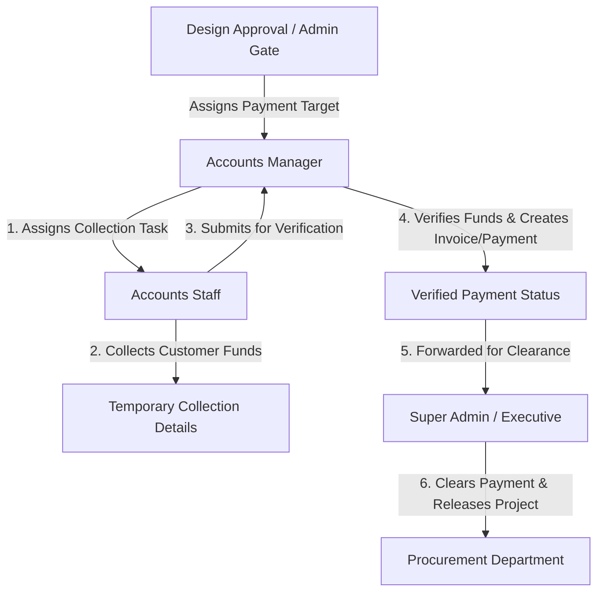

# Accounts & Finance Department Operations & Technical Specification
**Project:** Interior Design & Execution ERP System (Ryphira / Inter-Des)  
**Module:** Accounts Department (`/src/models/accounts`, `/src/controllers/accounts`, `/src/views/Accounts`)  
**Date:** August 21, 2026  
**Document Version:** 1.0.0  

---

## Executive Summary

The **Accounts & Finance Department** is the financial governance engine of the platform. It manages customer invoicing, advance deposit collections, payment verifications, project expense logging, vendor payables, and enterprise profit margin analytics.

The department acts as a mandatory financial gatekeeper: **no project can proceed from Design to Procurement without advance payment collection and verification by Accounts and Admin**.

---

## 1. Accounts Department Roles & Hierarchy



### 1.1 Accounts Manager (`role: 'Accounts Manager'`)
* Oversees all project payment collections and financial reporting.
* Assigns advance payment collection tasks (`assignAccountsStaff`) to specific Accounts Staff members.
* Verifies payment receipts logged by staff (`verifyPaymentAndRelease`).
* Authorizes direct payment clearances (`clearProjectPayment`).
* Monitors company cash flow trends, expense breakdowns, and monthly financial performance (`getAccountsPerformance`).

### 1.2 Accounts Staff (`role: 'Accounts Staff'`)
* Receives assigned payment collection tasks (`paymentCollectionStatus = 'Assigned'`).
* Coordinates with clients to collect advance deposits via Cash, Bank Transfer, UPI, Cheque, RTGS, or NEFT.
* Logs collection receipts (`submitPaymentCollection`) including amount, payment mode, reference/transaction ID, and notes into `tempCollectionDetails`.
* Logs project overheads, vendor bills, and site expenses (`Expense` model).

---

## 2. Core Functional Modules & Financial Engines

### 2.1 Advance Payment Collection & Verification Gate

When Superadmin approves a design (`adminReviewDesign`), the project enters the **`Accounts`** stage (`paymentStatus = 'Pending Advance'`).

#### 1. Collection Assignment (`assignAccountsStaff`)
The Accounts Manager assigns an `Accounts Staff` member to collect the required advance deposit:
* Updates `Project.assignedAccountsStaff = targetUserId`.
* Sets `Project.paymentCollectionStatus = 'Assigned'`.
* Fires push notification (`💰 New Payment Collection Task`) with target amount and due date.

#### 2. Staff Collection Logging (`submitPaymentCollection`)
Staff logs collected funds into `tempCollectionDetails`:
```javascript
tempCollectionDetails: {
  amount: Number(collectedAmount),
  paymentMode: 'UPI' | 'Bank Transfer' | 'Cash' | 'Cheque' | 'Card',
  referenceNumber: String,
  paymentNotes: String,
  collectedBy: Schema.Types.ObjectId,
  collectedAt: Date
}
```
* Sets `Project.paymentCollectionStatus = 'Collected'`.
* Notifies Accounts Managers (`💰 Payment Collected - Verify`).

#### 3. Manager Verification & Release (`verifyPaymentAndRelease`)
Accounts Manager reviews and verifies the funds:
1. Auto-creates or updates customer `Invoice` (`INV-YYYY-XXX`).
2. Creates an immutable `Payment` record in MongoDB.
3. Updates `Project.collectedAmount += paid`.
4. Computes payment status:
   $$\text{paymentStatus} = \begin{cases} \text{Cleared} & \text{if } \text{collectedAmount} \ge \text{budget} \\ \text{Cleared} & \text{if } \text{collectedAmount} \ge \text{advanceAmount} \\ \text{Partial Payment} & \text{otherwise} \end{cases}$$
5. Clears `tempCollectionDetails` and sets `paymentCollectionStatus = 'Verified'`.
6. Notifies Superadmin (`💵 Payment Verified — Awaiting Clearance`).

---

### 2.2 Customer Invoicing & Payment Tracking (`Invoice` & `Payment` Models)

#### 1. Invoice Generation (`Invoice` Model)
* Unique invoice number sequence: `INV-YYYY-XXX`.
* Calculates subtotal, tax (default 18%), and grand total:
  $$\text{Grand Total} = \text{Subtotal} + \text{Total Tax}$$

#### Automated Invoice Pre-Save Hook
`Invoice.js` evaluates payment progress before save:
$$\text{Status} = \begin{cases} \text{Paid} & \text{if } \text{amountPaid} \ge \text{grandTotal} \\ \text{Partially Paid} & \text{if } \text{amountPaid} > 0 \\ \text{Overdue} & \text{if } \text{dueDate} < \text{Now} \text{ and } \text{status} \neq \text{Paid} \\ \text{Draft} / \text{Sent} & \text{otherwise} \end{cases}$$

---

### 2.3 Project Expense Logging (`Expense` Model)

Expenses are logged under specific categories: `Material`, `Labor`, `Transport`, `Equipment`, `Permit`, `Consultation`, `Food`, `Stationery`, `Fuel`, `Travel`, `Office Supplies`, `Company Overhead`, `Miscellaneous`.

#### Automated Budget Increment Hook
When an expense is created (`createExpense`), updated (`updateExpense`), or deleted (`deleteExpense`), the controller automatically adjusts the linked project's total `spent` field using MongoDB `$inc`:

$$\Delta \text{Spent} = \text{New Expense Amount} - \text{Old Expense Amount}$$

---

### 2.4 Project & Enterprise Financial Analytics Engine (`accountsStatsController.js`)

#### 1. Individual Project Financials (`getProjectFinancials`)
Computes real-time profitability per project:
$$\text{Total Expenses} = \sum \text{Expense Amount}$$
$$\text{Total Received} = \sum \text{Invoice Amount Paid}$$
$$\text{Net Project Profit} = \text{Total Received} - \text{Total Expenses}$$
$$\text{Profit Margin \%} = \begin{cases} \left(\frac{\text{Net Project Profit}}{\text{Total Received}}\right) \times 100 & \text{if Total Received} > 0 \\ 0 & \text{otherwise} \end{cases}$$

#### 2. Enterprise Financial Performance (`getAccountsStats`)
Aggregates company-wide financial metrics:
* **Cash Balance:** $\text{Total Payments Received} - \text{Total Expenses}$.
* **Month-over-Month Revenue Trend:**
  $$\text{Revenue Trend \%} = \left(\frac{\text{Current Month Revenue} - \text{Previous Month Revenue}}{\text{Previous Month Revenue}}\right) \times 100$$
* **6-Month Cash Flow Data:** Computes monthly inflow ($\sum \text{Payments}$) vs outflow ($\sum \text{Expenses}$) for the last 6 months for chart visualization.
* **Expenses by Category Breakdown:** Aggregates costs per expense type using MongoDB `$group` pipelines.

---

## 3. Data Models & Database Schemas (Accounts Module)

### 3.1 Payment Schema (`Backend/src/models/accounts/Payment.js`)
```javascript
{
  paymentNumber: { type: String, unique: true, sparse: true }, // e.g. PAY-2026-0001
  project: { type: Schema.Types.ObjectId, ref: 'Project', required: true },
  invoice: { type: Schema.Types.ObjectId, ref: 'Invoice', required: true },
  client: { type: Schema.Types.ObjectId, ref: 'Client', required: true },
  amount: { type: Number, required: true, min: 0 },
  paymentDate: { type: Date, default: Date.now },
  paymentMethod: {
    type: String,
    enum: ['Cash', 'Bank Transfer', 'Cheque', 'UPI', 'Card', 'RTGS', 'NEFT', 'Other'],
    required: true
  },
  transactionId: { type: String, trim: true },
  reference: { type: String, trim: true },
  notes: { type: String, trim: true },
  receivedBy: { type: Schema.Types.ObjectId, ref: 'User', required: true }
}
```

### 3.2 Expense Schema (`Backend/src/models/accounts/Expense.js`)
```javascript
{
  expenseNumber: { type: String, unique: true, sparse: true }, // e.g. EXP-2026-0001
  project: { type: Schema.Types.ObjectId, ref: 'Project' },
  type: {
    type: String,
    enum: ['Material', 'Labor', 'Transport', 'Equipment', 'Permit', 'Consultation', 'Food', 'Stationery', 'Fuel', 'Travel', 'Office Supplies', 'Company Overhead', 'Miscellaneous'],
    required: true
  },
  category: { type: String, trim: true },
  description: { type: String, required: true, trim: true },
  amount: { type: Number, required: true, min: 0 },
  vendor: { type: Schema.Types.ObjectId, ref: 'Vendor' },
  vendorName: { type: String, trim: true },
  purchaseOrder: { type: Schema.Types.ObjectId, ref: 'PurchaseOrder' },
  invoice: { type: Schema.Types.ObjectId, ref: 'Invoice' },
  expenseDate: { type: Date, default: Date.now },
  paymentStatus: { type: String, enum: ['Pending', 'Paid', 'Partially Paid'], default: 'Pending' },
  paidAmount: { type: Number, default: 0 },
  paymentDate: Date,
  receipt: String,
  notes: String,
  createdBy: { type: Schema.Types.ObjectId, ref: 'User', required: true }
}
```

---

## 4. API Endpoints Reference

### 4.1 Accounts Routes (`/api/accounts`)

| Method | Endpoint | Description | Auth Roles Allowed |
| :--- | :--- | :--- | :--- |
| `GET` | `/api/accounts/projects/pending` | Fetch projects pending advance collection | Accounts Team, Admin |
| `POST` | `/api/accounts/projects/assign` | Assign staff member to collect payment | Admin, Accounts Manager |
| `POST` | `/api/accounts/projects/collect` | Staff logs payment collection | Admin, Accounts Manager, Staff |
| `POST` | `/api/accounts/projects/verify-payment` | Manager verifies collection & creates Payment/Invoice | Admin, Accounts Manager |
| `POST` | `/api/accounts/projects/clear` | Manager clears payment for Admin release | Admin, Accounts Manager |
| `GET` | `/api/accounts/payments` | Fetch all payment records | Accounts Team, Admin |
| `POST` | `/api/accounts/payments` | Create payment record manually | Accounts Team, Admin |
| `GET` | `/api/accounts/expenses` | Fetch expense list | Accounts Team, Admin |
| `POST` | `/api/accounts/expenses` | Log new expense (auto-increments project `spent`) | Accounts Team, Admin |
| `PUT` | `/api/accounts/expenses/:id` | Update expense details (adjusts project `spent`) | Accounts Team, Admin |
| `DELETE` | `/api/accounts/expenses/:id` | Delete expense (decrements project `spent`) | Accounts Manager, Admin |
| `GET` | `/api/accounts/project/:projectId/financials` | Fetch project financial breakdown & margin | Accounts Team, Admin |
| `GET` | `/api/accounts/stats` | Enterprise financial stats & 6-month cash flow chart | Accounts Manager, Admin |
| `GET` | `/api/accounts/performance` | Accounts staff collection performance metrics | Accounts Manager, Admin |

---

## 5. Frontend View & Component Architecture

Accounts operates under views located in `/src/views/Accounts`:

1. **`AccountsDashboard.jsx` (`/src/views/Accounts/manager`):**
   * High-level financial KPIs: Cash Balance, Total Invoiced, Collected Revenue, Total Expenses, Outstanding Dues.
   * 6-Month Cash Flow chart (Inflow vs Outflow).
   * Expenses by Type distribution pie chart.
2. **`PendingPaymentProjects.jsx` (`/src/views/Accounts`):**
   * Collection Queue showing projects requiring advance deposits.
   * Modal to assign staff members or verify staff-logged collections.
3. **`ExpensesView.jsx` (`/src/views/Accounts`):**
   * Expense logging studio with category selectors, vendor linkers, and receipt attachment uploads.
4. **`PaymentsView.jsx` (`/src/views/Accounts`):**
   * Complete payment history log with search, date range filters, and transaction reference verification.
