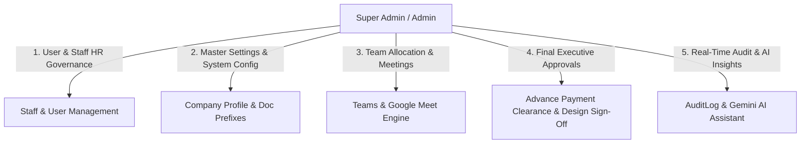

# Admin & Executive Management Department Operations & Technical Specification
**Project:** Interior Design & Execution ERP System (Ryphira / Inter-Des)  
**Module:** Admin Department (`/src/models/admin`, `/src/controllers/admin`, `/src/views/admin`)  
**Date:** August 21, 2026  
**Document Version:** 1.0.0  

---

## Executive Summary

The **Admin & Executive Management Department** is the central governance, security, human resources, and system configuration nexus of the ERP platform. It is responsible for user provisioning, staff HR administration, salary structure maintenance, team allocation, company-wide meeting management, project milestones, AI assistant integrations, web push notifications, system settings, and cross-departmental audit logging.

Executives (`Super Admin`, `Admin`, `Manager`) have top-level visibility across all six operational departments, holding ultimate authority over financial payment clearances, design approval releases, and immutable project lock/unlock actions.

---

## 1. Executive Roles & Governance Scope



### 1.1 Super Admin / Admin (`role: 'Super Admin'`, `'Admin'`)
* Full read/write access across all system modules.
* User account creation, role assignment (`User` model), and access revocation.
* Staff HR administration (`Staff` model) including salary package configurations (Base, HRA, TA, PF, Tax).
* Approval authority for project advance payment clearances, design stage transitions, and production completions.
* Master control over system lock/unlock overrides (`unlockProject`, `rejectUnlockRequest`).
* System settings configuration (`Settings` model) including company profile, quotation/invoice prefixes, and default tax rates.

### 1.2 General Manager (`role: 'Manager'`)
* Operational oversight of company meetings (`Meeting` model) and milestone schedules.
* Reviewing staff reports (`StaffReport` model) and leave applications (`LeaveRequest`).
* High-level analytics inspection (Employee performance analysis, company financial summaries).

---

## 2. Core Functional Modules & Infrastructure

### 2.1 User & HR Staff Administration (`User` & `Staff` Models)

#### 1. System Users (`User` Model)
* Implements authentication via JWT (`getSignedJwtToken`) and bcrypt password hashing (`matchPassword`).
* Pre-save hook automatically infers and assigns the `department` enum based on the user's `role`.
* Unique `staffId` constraint supporting sparse indexing.

#### 2. Staff HR Profiles (`Staff` Model)
* Auto-generates sequential staff IDs: `STF-0001`, `STF-0002`, etc.
* Manages granular salary component structures:
  ```javascript
  salary: {
    baseSalary: Number,
    hra: Number,
    travelAllowance: Number,
    otherAllowances: Number,
    providentFund: Number,
    taxDeduction: Number,
    otherDeductions: Number,
    effectiveFrom: Date,
    notes: String
  }
  ```

---

### 2.2 Meeting & Video Conference Engine (`Meeting` Model)

The meeting module manages internal team syncs and client consultations:
* Stores title, description, Google Meet link (`meetLink`), scheduled time (`scheduledAt`), duration (minutes), and invitees list (`invitees[]`).
* **Computed Live Status Virtual (`computedStatus`):** Automatically calculates meeting state without database polling:
  $$\text{Computed Status} = \begin{cases} \text{'cancelled'} & \text{if status is cancelled} \\ \text{'upcoming'} & \text{if Now} < \text{Scheduled Start} \\ \text{'ongoing'} & \text{if Scheduled Start} \le \text{Now} \le \text{Scheduled End} \\ \text{'completed'} & \text{if Now} > \text{Scheduled End} \end{cases}$$

---

### 2.3 System Settings & Document Preferences (`Settings` Model)

Single-document static configuration model (`SettingsSchema.statics.getSettings`):
* **Company Profile:** Company Name, Logo, Address, Phone, Email, GSTIN, Website, Motto.
* **Document Defaults:** Default Tax Rate (default 18%), Quotation Prefix (`QT-`), Invoice Prefix (`INV-`), Quotation Validity (days), Currency Symbol (`₹`).
* **Security & System Rules:** Default Role, Minimum Password Length, Session Timeout (`30d`).
* **Notification Preferences:** Task deadline alert threshold (hours), low stock threshold, email notifications toggle.

---

### 2.4 Real-Time Web Push & Notification Engine (`Notification` & `PushSubscription` Models)

* **Multi-Channel Dispatch (`notificationHelper.js`):** Supports individual recipient targeting (`notifyUser`), role-based regex broadcasting (`notifyByRole`), and staff user lookup by email (`notifyStaffUser`).
* **Automated Deadline Checker Engine (`checkTaskDeadlines`):** Scans tasks every 60 minutes and dispatches `Warning` (due in $\le 24$h), `Info` (due in $\le 48$h), or `Error` (overdue) notifications.
* **Web Push Subscriptions:** Stores Web Push API browser subscription endpoints (`PushSubscription` model) for background desktop push alerts.

---

### 2.5 System Audit Logging (`AuditLog` Model)

Maintains an immutable compliance log for critical operational events:
* Logs `userId`, `action` (*e.g., 'BOQ Rejected', 'Payment Cleared', 'Project Unlocked'*), `module` (*Project, Task, BOQ, Material, Workflow*), `referenceId`, `oldValue`, `newValue`, `description`, `ipAddress`, and `userAgent`.

---

### 2.6 AI Assistant Integration (`aiRoutes.js` & `AIChat.jsx`)

Integrates AI capabilities into the admin dashboard:
* Provides project summary generation, BOQ item suggestions, risk analysis, and employee report evaluations.
* Implements tight rate-limiting (`aiLimiter`: max 10 requests per minute) to prevent API quota exhaustion.

---

## 3. Data Models & Database Schemas (Admin Module)

### 3.1 User Schema (`Backend/src/models/admin/User.js`)
```javascript
{
  fullName: { type: String, required: true, trim: true },
  email: { type: String, required: true, unique: true, lowercase: true },
  staffId: { type: String, unique: true, sparse: true },
  phone: String,
  password: { type: String, required: true, select: false },
  role: {
    type: String,
    enum: [
      'Super Admin', 'Admin', 'Design Manager', 'Design Staff',
      'Procurement Manager', 'Procurement Staff', 'Project Manager',
      'Project Engineer', 'Site Engineer', 'Site Supervisor',
      'Sales', 'Accounts Manager', 'Accounts Staff', 'Manager', 'Staff', 'User'
    ],
    default: 'User'
  },
  department: { type: String, enum: ['Design', 'Procurement', 'Production', 'Accounts', 'Sales', 'Admin', null] },
  status: { type: String, enum: ['Active', 'Inactive', 'Suspended'], default: 'Active' },
  avatar: String,
  lastLogin: Date
}
```

### 3.2 Staff Schema (`Backend/src/models/admin/Staff.js`)
```javascript
{
  staffId: { type: String, unique: true }, // e.g. STF-0001
  name: { type: String, required: true },
  email: String,
  phone: { type: String, required: true },
  role: { type: String, required: true },
  joiningDate: { type: Date, default: Date.now },
  status: { type: String, enum: ['Active', 'On Leave', 'Inactive'], default: 'Active' },
  salary: {
    baseSalary: { type: Number, default: 0 },
    hra: { type: Number, default: 0 },
    travelAllowance: { type: Number, default: 0 },
    otherAllowances: { type: Number, default: 0 },
    providentFund: { type: Number, default: 0 },
    taxDeduction: { type: Number, default: 0 },
    otherDeductions: { type: Number, default: 0 },
    effectiveFrom: Date,
    notes: String
  }
}
```

### 3.3 Meeting Schema (`Backend/src/models/admin/Meeting.js`)
```javascript
{
  title: { type: String, required: true },
  description: String,
  meetLink: { type: String, required: true },
  scheduledAt: { type: Date, required: true },
  duration: { type: Number, default: 60 }, // minutes
  status: { type: String, enum: ['upcoming', 'ongoing', 'completed', 'cancelled'], default: 'upcoming' },
  createdBy: { type: Schema.Types.ObjectId, ref: 'User', required: true },
  invitees: [{
    user: { type: Schema.Types.ObjectId, ref: 'User', required: true },
    isRead: { type: Boolean, default: false },
    readAt: Date
  }]
}
```

---

## 4. API Endpoints Reference

### 4.1 Admin Governance & User Routes (`/api/users`, `/api/staff`, `/api/settings`)

| Method | Endpoint | Description | Auth Roles Allowed |
| :--- | :--- | :--- | :--- |
| `GET` | `/api/users` | List all system users | Admin, Super Admin |
| `POST` | `/api/users` | Register new system user | Admin, Super Admin |
| `PUT` | `/api/users/:id` | Update user role / status | Super Admin |
| `GET` | `/api/staff` | List staff members with salary data | Admin, Super Admin |
| `POST` | `/api/staff` | Create staff profile (auto-generates `STF-XXXX`) | Admin, Super Admin |
| `GET` | `/api/settings` | Get company settings & document rules | Admin, Super Admin |
| `PUT` | `/api/settings` | Update company settings | Super Admin |

---

### 4.2 Meetings, Leaves & Shared System Routes (`/api/meetings`, `/api/notifications`, `/api/ai`)

| Method | Endpoint | Description | Auth Roles Allowed |
| :--- | :--- | :--- | :--- |
| `GET` | `/api/meetings` | List scheduled meetings | Authenticated Users |
| `POST` | `/api/meetings` | Schedule new Google Meet session | Admin, Manager |
| `GET` | `/api/notifications` | Get recipient notifications | Authenticated Users |
| `PUT` | `/api/notifications/:id/read` | Mark notification as read | Authenticated Users |
| `POST` | `/api/ai/chat` | Send prompt to AI Assistant | Admin, Super Admin |

---

## 5. Frontend View & Component Architecture

Admin views operate under `Layout.jsx` for executive users (`/src/views/admin`):

1. **`Dashboard.jsx` (`/src/views/admin`):**
   * Master executive dashboard showing real-time counters for Active Projects, Total Revenue, Pending Quotations, Open Tasks, Low Stock Alerts, and Recent Activity Feed.
2. **`Users.jsx` & `Staff.jsx` (`/src/views/admin`):**
   * Account management tables with modal forms for user role assignment, status toggling, and HR salary package editing.
3. **`Settings.jsx` (`/src/views/admin`):**
   * Master settings studio for company branding, GSTIN, invoice prefixes, tax defaults, and security policies.
4. **`Meetings.jsx` (`/src/views/admin`):**
   * Google Meet scheduling interface with live status indicators (`Upcoming`, `Ongoing`, `Completed`).
5. **`AIChat.jsx` (`/src/views/admin`):**
   * Embedded executive AI assistant for natural-language project querying and BOQ optimization.
