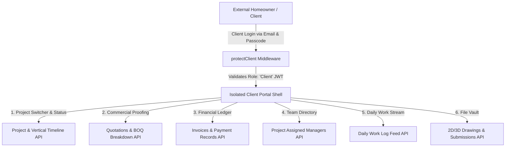

# Client Portal Operations & Technical Specification
**Project:** Interior Design & Execution ERP System (Ryphira / Inter-Des)  
**Module:** External Client Portal (`/src/controllers/shared/clientPortalController.js`, `/src/middleware/clientAuth.js`, `/src/views/client-portal`)  
**Date:** August 21, 2026  
**Document Version:** 1.0.0  

---

## Executive Summary

The **External Client Portal** is a secure, isolated client-facing web application interface that grants homeowners, commercial clients, and project owners real-time visibility into their interior design and execution progress.

Using dedicated Client Authentication (`protectClient` middleware), clients can track vertical project timelines, review and approve BOQ quotations, monitor invoice payment statuses, view assigned department managers, inspect daily site work updates, and download project design drawings and files—without accessing internal administrative controls.

---

## 1. Portal Architecture & Security Isolation

### 1.1 Authentication & Security Isolation (`clientAuth.js`)
* **Dedicated Client Middleware (`protectClient`):** Enforces separate JWT token verification specifically checking `decoded.role === 'Client'`.
* **Zero Internal Privilege:** Clients are strictly restricted to endpoints under `/api/client/*`. They cannot access internal staff routes (`/api/tasks`, `/api/projects`, `/api/users`).
* **Multi-Project Dropdown Switcher (`getClientProjectsList`):** Allows clients with multiple properties to seamlessly switch between active and completed projects.

---

## 2. Core Portal Features & Data Mapping

### 2.1 Project Overview & Vertical Timeline Generator (`getClientProject` & `getTimelineFromProject`)

Generates a dynamic 5-milestone vertical timeline based on real-time database attributes:

$$\text{Timeline Milestone Status} = \begin{cases} \text{'completed'} & \text{if stage step condition is met} \\ \text{'in-progress'} & \text{if current active stage matches step} \\ \text{'pending'} & \text{otherwise} \end{cases}$$

#### The 5 Customer Milestones:
1. **Project Setup & Advance Payment:** `paymentStatus === 'Pending Advance' ? 'in-progress' : 'completed'`
2. **Design Phase (2D/3D Layouts):** `designComplete ? 'completed' : (stage === 'Design' ? 'in-progress' : 'pending')`
3. **Procurement & Material Readiness:** `materialsReady ? 'completed' : ('in-progress' / 'pending')`
4. **Manufacturing & Production:** `productionComplete ? 'completed' : (stage === 'Production' ? 'in-progress' : 'pending')`
5. **Installation & Handover:** `handoverComplete ? 'completed' : ('in-progress' / 'pending')`

---

### 2.2 Commercial Proofing & Invoicing (`getClientQuotations`, `getClientInvoices`, `getClientPayments`)

* **Quotations View (`getClientQuotations`):** Displays itemized BOQ breakdowns, subtotal, tax rate, offer price, and valid-until dates.
* **Invoices Ledger (`getClientInvoices`):** Displays issued customer invoices (`INV-YYYY-XXX`), grand totals, amount paid, due dates, and payment status (`Draft`, `Paid`, `Partially Paid`, `Overdue`).
* **Payment Receipts (`getClientPayments`):** Logs confirmed payment transactions (`PAY-YYYY-XXXX`) including date, payment method (*Cash, Bank Transfer, UPI, Cheque, Card*), transaction ID, and notes.

---

### 2.3 Team Directory & Communication (`getClientWorkingMembers`)

Dynamically populates the client's dedicated project team directory:
* **Design Manager:** Name, email, phone, avatar.
* **Procurement Manager:** Name, email, phone, avatar.
* **Production Manager:** Name, email, phone, avatar.
* **Accounts Contact:** Name, email, phone, avatar.

---

### 2.4 Live Site Updates & Document Vault (`getClientGroupUpdates` & `getClientDocuments`)

#### 1. Daily Work Stream (`getClientGroupUpdates`)
Flattens and displays all daily updates (`dailyUpdates[]`) logged across all project tasks by site staff, ordered chronologically (newest first) with staff avatars and emergency notices.

#### 2. Digital Document Vault (`getClientDocuments`)
Aggregates and exposes files linked to project tasks:
* **General Task Attachments:** Site photos, survey PDFs.
* **Formal Design Submissions:** 2D DWG CAD layouts, 3D Renders, material spec sheets (`Submission` / `2D` / `3D`).

---

## 3. API Endpoints Reference (Client Portal)

All endpoints require JWT token authenticated via `protectClient` middleware:

| Method | Endpoint | Description |
| :--- | :--- | :--- |
| `GET` | `/api/client/projects-list` | Fetch dropdown list of client's projects |
| `GET` | `/api/client/project` | Fetch active project details & 5-step vertical timeline |
| `GET` | `/api/client/quotations` | Fetch BOQ quotations linked to client's project |
| `GET` | `/api/client/invoices` | Fetch customer invoices and payment status |
| `GET` | `/api/client/payments` | Fetch confirmed payment transaction receipts |
| `GET` | `/api/client/members` | Fetch assigned department managers directory |
| `GET` | `/api/client/updates` | Fetch live stream of site daily progress updates |
| `GET` | `/api/client/documents` | Fetch file vault (2D/3D layouts & design submissions) |

---

## 4. Frontend Client Portal Architecture (`/src/views/client-portal`)

The frontend renders an isolated client portal shell (`ClientRoutes.jsx`):

1. **`ClientDashboard.jsx`:** Main dashboard presenting overall progress bar, active stage indicator, recent daily site updates, and team directory cards.
2. **`ClientTimeline.jsx`:** Vertical milestone component visualizer showing real-time stage progression.
3. **`ClientQuotations.jsx` & `ClientInvoices.jsx`:** Financial proofing screens allowing clients to review BOQ items and inspect invoice payment balances.
4. **`ClientDocuments.jsx`:** Document vault allowing high-resolution preview and download of 2D floor plans and 3D interior renders.
