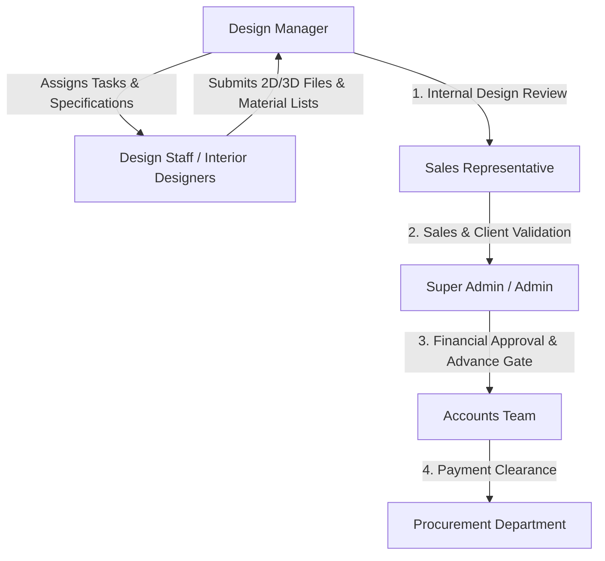
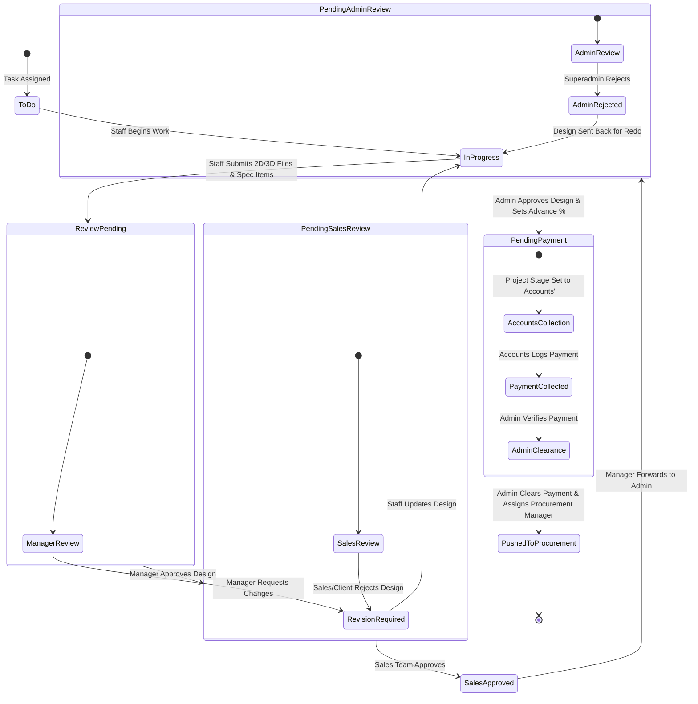

# Design Department Operations & Technical Specification
**Project:** Interior Design & Execution ERP System (Ryphira / Inter-Des)  
**Module:** Design Department (`/src/models/design`, `/src/controllers/design`, `/src/views/design`)  
**Date:** August 21, 2026  
**Document Version:** 1.0.0  

---

## Executive Summary

The **Design Department** serves as the creative engine and technical bridge between client requirements (Sales BOQs) and physical procurement & site execution. It is responsible for spatial planning, 2D layout drafting, 3D visualization, material selection, edge band matching, and technical bill-of-materials (BOM) compilation.

The module enforces a **6-stage approval pipeline** to ensure that no design reaches procurement or factory execution without rigorous review by Design Managers, Sales Representatives, Executive Admins, and Accounts (for advance payment verification).

---

## 1. Design Department Roles & Responsibilities



### 1.1 Design Manager (`role: 'Design Manager'`)
* Oversees all design projects, workload distribution, and task assignment.
* Conducts initial quality assurance (QA) on 2D layouts and 3D renders submitted by design staff.
* Reviews and approves Edge Band requests (`EdgeBandRequest`).
* Coordinates design revisions when requested by Sales or Admin.
* Triggers design handoff to Super Admin once Sales approval is obtained.

### 1.2 Design Staff / Interior Designers (`role: 'Design Staff'`)
* Receives creative requirements and specs from Design Managers or Sales BOQs.
* Executes CAD drawings (2D floor plans, elevations) and 3D renders.
* Uses the **Edge Band Fuzzy Matcher** tool to select precise edge bands for laminates/veneers.
* Submits completed design packages (`submissions[]`) with itemized design specs for manager approval.
* Provides daily progress updates and extension requests on tasks.

---

## 2. Core Functional Modules

### 2.1 Task & Kanban Work Management
* **Task Allocation:** Tasks are created under specific Projects, linked to Clients and Quotations.
* **Granular Status Tracking:** Tasks transition through explicit states:
  * `To Do` $\rightarrow$ `In Progress` $\rightarrow$ `Review Pending` $\rightarrow$ `Revision Required` $\rightarrow$ `Pending Sales Review` $\rightarrow$ `Sales Approved` $\rightarrow$ `Pending Admin Review` $\rightarrow$ `Pending Payment` $\rightarrow$ `Pushed to Procurement`.
* **Submissions Array (`submissions[]`):** Captures design files (2D/3D), designer notes, item lists (name, size, unit, quantity), and reviewer feedback.
* **Activity Timeline (`timeline[]`):** Every status change, comment, or revision request logs an immutable audit event (`created`, `started`, `submitted`, `revisionRequested`, `approved`, `salesApproved`, `sentToAdmin`, `adminReviewed`, `pushed`).

---

### 2.2 Edge Band Fuzzy Matching Engine (`edgeBandMatcher.js` & `edgeBandService.js`)

In interior furniture fabrication, laminates and edge bands are matched by code, finish, and dimension. Because codes entered by designers often contain typos, formatting variations, or missing hyphens, the system provides a **Server-Side Levenshtein & Token-Based Fuzzy Matcher**.

#### Matching Algorithm Details (`matchEdgeBands`)
1. **Input Normalization:** Converts input text to uppercase and extracts alphanumeric clean strings, pure digit strings, and token arrays.
2. **Multi-Tiered Scoring:**
   * **Exact Match (100%):** Exact string match or identical clean alphanumeric string.
   * **Prefix / Stretch Match (90% / 80%):** Code starts with query or query starts with target code.
   * **Substring Match (85%):** Target code contains query (length $\ge 2$).
   * **Token Overlap (80%):** Query tokens match target tokens (e.g. sharing prefix codes like "MER" or "EB").
   * **Digit Overlap (75%):** Query digits match target code digits.
   * **Levenshtein Distance Calculation:** Compute edit distance $d$:
     * $d \le 1 \implies 90\%$ match
     * $d \le 2 \implies 80\%$ match
     * $d \le 4 \implies 70\%$ match
     * $d > 4 \implies 0\%$ match (Filtered out)
3. **Filtering & Ranking:** Filters out all candidate items with match score $< 70\%$, sorts descending by match score, and returns top 50 items.

#### Standard Fixed Dimensions (`FIXED_DIMENSIONS`)
Only 4 standard edge band dimensions are supported by the manufacturing spec:
* `22x0.8` (22mm width $\times$ 0.8mm thickness)
* `22x2` (22mm width $\times$ 2.0mm thickness)
* `45x0.8` (45mm width $\times$ 0.8mm thickness)
* `45x2` (45mm width $\times$ 2.0mm thickness)

#### Server-Side Security & Upsert Logic (`saveSelections`)
* Match percentage is **re-calculated on the backend** (never trusted from the client payload).
* **Unique Compound Index Constraint:** `(project, brand, matchedCode, dimension)`.
* Saving duplicate edge bands automatically increments the existing record's `quantity` via MongoDB `$inc`.
* Automatically creates/syncs an `EdgeBandRequest` for Manager approval upon saving selections.

---

## 3. End-to-End Design Approval Pipeline & State Machine



### Detailed Pipeline Steps & Backend Handlers

#### Step 1: Designer Submission (`submitTask`)
* **Trigger:** Design Staff submits final renders/drawings and item specs.
* **State Change:** Task status $\rightarrow$ `ReviewPending`.
* **Actions:** Notifies Design Manager.

#### Step 2: Design Manager Review (`reviewSubmission`)
* **Handler:** `taskApprovalService.reviewSubmission`
* **If Approved:** Task status $\rightarrow$ `PendingSalesReview`. Sends notification to Sales team (`🎨 New Design for Review`).
* **If Rejected:** Task status $\rightarrow$ `Revision Required`. Sends notification with `managerFeedback` to designer.

#### Step 3: Sales & Client Review (`salesApproveTask`)
* **Handler:** `taskApprovalService.salesApproveTask`
* **If Approved:** Task status $\rightarrow$ `SalesApproved`. Notifies Design Manager (`✅ Sales Approved Design`).
* **If Rejected:** Task status $\rightarrow$ `Revision Required`. Notifies Design Manager with `salesNotes`.

#### Step 4: Manager Forwarding to Admin (`managerSendToAdmin`)
* **Handler:** `taskApprovalService.managerSendToAdmin`
* **Pre-condition:** Must be `SalesApproved`.
* **State Change:** Task status $\rightarrow$ `PendingAdminReview`.
* **Actions:** Notifies Superadmin (`📋 Design Pending Your Approval`).

#### Step 5: Admin Design Approval & Financial Gate (`adminReviewDesign`)
* **Handler:** `taskApprovalService.adminReviewDesign`
* **Pre-condition:** Must be `PendingAdminReview`.
* **Actions:**
  1. Auto-creates `Project` & draft `Invoice` if not existing.
  2. Calculates Advance Deposit Amount (Default 30% or custom percentage):
     $$\text{Advance Amount} = \text{Quotation Total} \times \left(\frac{\text{Advance \%}}{100}\right)$$
  3. Sets Task status to **`Pending Payment`** (does **not** push to procurement yet).
  4. Sets Project stage to **`Accounts`** (`paymentStatus = 'Pending Advance'`).
  5. Assigns Accounts Manager/Staff and fires alert (`💰 New Payment Collection Request`).

#### Step 6: Accounts Payment Collection (`accountsCollectPayment`)
* **Handler:** `taskApprovalService.accountsCollectPayment`
* **Pre-condition:** Project stage must be `Accounts`.
* **Actions:** Logs payment details (`amount`, `paymentMode`, `referenceNumber`), updates `collectedAmount`, and notifies Admin (`💵 Payment Collected — Awaiting Your Clearance`).

#### Step 7: Admin Clearance & Procurement Push (`adminClearPaymentToProcurement`)
* **Handler:** `taskApprovalService.adminClearPaymentToProcurement`
* **Pre-condition:** Payment collected must meet required advance amount (or force override by Admin).
* **Actions:**
  1. Compiles design items + Edge Band items (`fetchEdgeBandItemsForProject`).
  2. Auto-generates `MaterialRequest` (`MR-YYYY-XXXX`) marked with `isPushedFromDesign = true`.
  3. Updates Task status to **`Pushed to Procurement`**.
  4. Updates Project stage to **`Procurement`** (`designComplete = true`).
  5. Assigns designated `Procurement Manager` and fires notification (`📦 New Project Assigned for Procurement`).

---

## 4. Data Models & Database Schemas (Design Module)

### 4.1 Project Schema (`Backend/src/models/design/Project.js`)
```javascript
{
  projectNumber: { type: String, unique: true, required: true }, // e.g. PRJ-2026-0001
  client: { type: Schema.Types.ObjectId, ref: 'Client', required: true },
  quotation: { type: Schema.Types.ObjectId, ref: 'Quotation', required: true },
  name: { type: String, required: true },
  stage: { 
    type: String, 
    enum: ['Accounts', 'Design', 'Pending Payment', 'Procurement', 'Production', 'Completed'],
    default: 'Accounts'
  },
  status: { type: String, enum: ['Not Started', 'In Progress', 'On Hold', 'Completed', 'Cancelled'] },
  designComplete: { type: Boolean, default: false },
  materialsReady: { type: Boolean, default: false },
  productionComplete: { type: Boolean, default: false },
  handoverComplete: { type: Boolean, default: false },
  progress: { type: Number, min: 0, max: 100, default: 0 },
  assignedDesignManager: { type: Schema.Types.ObjectId, ref: 'User' },
  advancePercentage: { type: Number, default: 0 },
  advanceAmount: { type: Number, default: 0 },
  collectedAmount: { type: Number, default: 0 }
}
```

### 4.2 Task Schema (`Backend/src/models/design/Task.js`)
```javascript
{
  title: { type: String, required: true },
  description: { type: String },
  creativeRequirements: { type: String },
  project: { type: Schema.Types.ObjectId, ref: 'Project' },
  client: { type: Schema.Types.ObjectId, ref: 'Client' },
  quotation: { type: Schema.Types.ObjectId, ref: 'Quotation' },
  assignedTo: [{ type: Schema.Types.ObjectId, ref: 'Staff', required: true }],
  priority: { type: String, enum: ['Low', 'Medium', 'High', 'Critical'], default: 'Medium' },
  status: {
    type: String,
    enum: [
      'To Do', 'In Progress', 'Review Pending', 'Revision Required',
      'Completed', 'Approved', 'Rejected',
      'Pending Sales Review', 'Sales Approved',
      'Pending Admin Review', 'Admin Rejected',
      'Pending Payment',
      'Pushed to Procurement', 'Assigned to Procurement', 'Procurement Approved', 'Blocked'
    ],
    default: 'To Do'
  },
  submissions: [{
    files: [{ filename: String, url: String, fileType: String, uploadedAt: Date }],
    staffNotes: String,
    designItems: [{ name: String, size: String, unit: String, quantity: Number }],
    managerFeedback: String,
    status: { type: String, enum: ['Pending Review', 'Approved', 'Revision Required'] },
    submittedBy: { type: Schema.Types.ObjectId, ref: 'Staff' },
    submittedAt: Date,
    reviewedBy: { type: Schema.Types.ObjectId, ref: 'User' }
  }],
  timeline: [{
    action: { type: String, required: true },
    performedBy: { type: Schema.Types.ObjectId, ref: 'User' },
    details: String,
    timestamp: { type: Date, default: Date.now }
  }],
  dailyUpdates: [{
    staff: { type: Schema.Types.ObjectId, ref: 'Staff' },
    update: { type: String, required: true },
    emergencies: String,
    extensionRequest: { requestedDate: Date, reason: String, status: String }
  }]
}
```

### 4.3 EdgeBand Schema (`Backend/src/models/design/EdgeBand.js`)
```javascript
{
  brand: { type: String, required: true, trim: true },
  code: { type: String, required: true, uppercase: true }, // e.g. MER-2041
  name: { type: String, required: true },
  finish: { type: String },
  material: { type: String },
  dimensions: [{
    dimension: { type: String, enum: ['22x0.8', '22x2', '45x0.8', '45x2'], required: true },
    available: { type: Boolean, default: true }
  }]
}
```

### 4.4 EdgeBandSelection Schema (`Backend/src/models/design/EdgeBandSelection.js`)
```javascript
{
  project: { type: Schema.Types.ObjectId, ref: 'Project', required: true },
  task: { type: Schema.Types.ObjectId, ref: 'Task' },
  brand: { type: String, required: true },
  enteredCode: { type: String, required: true, uppercase: true },
  matchedCode: { type: String, required: true, uppercase: true },
  matchPercentage: { type: Number, required: true, min: 70, max: 100 },
  edgeBandRef: { type: Schema.Types.ObjectId, ref: 'EdgeBand', required: true },
  dimension: { type: String, enum: ['22x0.8', '22x2', '45x0.8', '45x2'], required: true },
  quantity: { type: Number, required: true, min: 1 },
  createdBy: { type: Schema.Types.ObjectId, ref: 'User', required: true }
}
```

### 4.5 EdgeBandRequest Schema (`Backend/src/models/design/EdgeBandRequest.js`)
```javascript
{
  project: { type: Schema.Types.ObjectId, ref: 'Project', required: true },
  task: { type: Schema.Types.ObjectId, ref: 'Task' },
  submittedBy: { type: Schema.Types.ObjectId, ref: 'User', required: true },
  items: [{
    brand: String,
    enteredCode: String,
    matchedCode: String,
    matchPercentage: Number,
    edgeBandRef: { type: Schema.Types.ObjectId, ref: 'EdgeBand' },
    dimension: String,
    quantity: Number
  }],
  status: {
    type: String,
    enum: ['draft', 'pending_manager', 'pending_admin', 'approved', 'rejected'],
    default: 'pending_manager'
  },
  managerNote: String,
  adminNote: String,
  reviewedByManager: { type: Schema.Types.ObjectId, ref: 'User' },
  reviewedByAdmin: { type: Schema.Types.ObjectId, ref: 'User' }
}
```

---

## 5. API Endpoints Reference

### 5.1 Design & Task Routes (`/api/tasks`, `/api/design`)

| Method | Endpoint | Description | Auth Roles Allowed |
| :--- | :--- | :--- | :--- |
| `GET` | `/api/tasks` | Fetch list of design tasks (filtered by user role) | All authenticated users |
| `POST` | `/api/tasks` | Create new design task | Admin, Design Manager |
| `PUT` | `/api/tasks/:id` | Update task details | Admin, Design Manager |
| `POST` | `/api/tasks/:id/submit` | Submit design files & item specs | Design Staff |
| `PUT` | `/api/tasks/:id/review` | Review designer submission | Design Manager |
| `PUT` | `/api/tasks/:id/sales-approve` | Approve/reject design from sales side | Sales, Admin |
| `PUT` | `/api/tasks/:id/send-to-admin` | Manager forwards sales-approved design to Admin | Design Manager |
| `PUT` | `/api/tasks/:id/admin-review` | Superadmin approval & advance payment assignment | Super Admin, Admin |
| `POST` | `/api/projects/:id/collect-payment` | Accounts logs advance payment receipt | Accounts Manager, Staff |
| `POST` | `/api/projects/:id/clear-payment` | Admin verifies payment & pushes to Procurement | Super Admin, Admin |
| `POST` | `/api/tasks/:id/push-to-procurement` | Direct push to procurement | Super Admin, Admin |

---

### 5.2 Edge Band Routes (`/api/design/edge-bands`)

| Method | Endpoint | Description | Auth Roles Allowed |
| :--- | :--- | :--- | :--- |
| `GET` | `/api/design/edge-bands/brands` | Fetch distinct edge band brands | Authenticated Users |
| `GET` | `/api/design/edge-bands/search` | Search edge bands using fuzzy matcher algorithm | Authenticated Users |
| `POST` | `/api/design/edge-bands/selections` | Save edge band selections (auto-recalculates match %) | Design Staff, Manager |
| `GET` | `/api/design/edge-bands/selections/:projectId` | Get saved selections for a project | Authenticated Users |
| `DELETE` | `/api/design/edge-bands/selections/:id` | Delete an edge band selection item | Design Staff, Manager |
| `POST` | `/api/design/edge-bands/requests` | Submit edge band request for Manager approval | Design Staff |
| `GET` | `/api/design/edge-bands/requests` | Fetch edge band approval requests | Design Manager, Admin |
| `PUT` | `/api/design/edge-bands/requests/:id/manager-review` | Manager review of edge band request | Design Manager |
| `PUT` | `/api/design/edge-bands/requests/:id/admin-review` | Admin final sign-off of edge band request | Super Admin, Admin |

---

## 6. Frontend UI Components & Architecture

### 6.1 `MaterialReviewHub.jsx` (`/src/views/design/manager/MaterialReviewHub.jsx`)
* Centralized hub for Design Managers & Superadmins to view submitted material specs and edge band matchings.
* Displays match percentage score badges (Green $\ge 90\%$, Yellow $80-89\%$, Orange $70-79\%$).
* Provides action controls to approve selections, request rechecks, or edit quantities prior to forwarding to procurement.

### 6.2 `DesignApprovals.jsx` (`/src/views/admin/DesignApprovals.jsx`)
* Admin interface for reviewing designs that have passed Sales approval (`Pending Admin Review`).
* Allows setting custom advance payment percentages, due dates, payment notes, and assigning specific Accounts Managers.

### 6.3 Design Staff View (`/src/views/sales/SalesTasks.jsx` & Staff Portal)
* Designer task dashboard showing assigned tasks, creative requirements, and due date countdowns.
* Embedded **Edge Band Selection Tool** allowing live search against database using fuzzy matching.
* Submission drawer allowing multi-file uploads (2D DWG, 3D Renders, PDF specs) and custom design item lists.

---

## 7. Quality Assurance & Error Prevention

1. **Client Trust Boundary:** The server **never trusts** match percentages or pricing sent from client web applications. All fuzzy match scores and total amounts are re-computed on Node.js controllers.
2. **Dimension Guards:** Only valid dimensions in `FIXED_DIMENSIONS` are allowed. Inactive or unavailable dimensions trigger `400 Bad Request`.
3. **No Skipping Approval Gates:** Direct status mutation without passing through intermediate approval states is blocked by `taskApprovalService.js` guards.
4. **Data Healing (`healTaskReferences`):** Automatically repairs missing project links by looking up matching project records by quotation ID before completing approval transitions.
