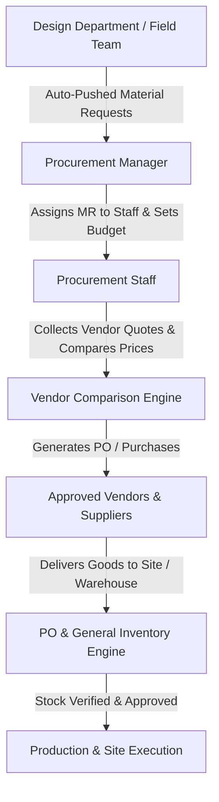

# Procurement Department Operations & Technical Specification
**Project:** Interior Design & Execution ERP System (Ryphira / Inter-Des)  
**Module:** Procurement Department (`/src/models/procurement`, `/src/controllers/procurement`, `/src/views/procurement`)  
**Date:** August 21, 2026  
**Document Version:** 1.0.0  

---

## Executive Summary

The **Procurement Department** is the supply chain lifecycle engine of the platform. It manages raw material requisitions pushed automatically from finalized 2D/3D design specifications or raised directly by site engineering teams. 

The department oversees **vendor onboarding, price matrix comparison, purchase order (PO) generation, direct vendor purchases, time extension governance, and real-time inventory stock management**. It ensures that all physical materials (boards, laminates, edge bands, hardware, fittings) arrive on site within budget and schedule before handoff to Production.

---

## 1. Procurement Roles & Hierarchy



### 1.1 Procurement Manager (`role: 'Procurement Manager'`)
* Oversees all material requests (`MaterialRequest`) assigned to the procurement department.
* Assigns specific procurement requests to **Procurement Staff** members.
* Evaluates vendor price comparisons (`VendorComparison`) and approves supplier selection.
* Evaluates time extension requests submitted by procurement staff.
* Signs off on Purchase Orders (POs) and submits final procurement packages for Admin release.

### 1.2 Procurement Staff (`role: 'Procurement Staff'`)
* Receives assigned material requests and initiates sourcing.
* Solicits quotes from vendors and inputs rates into the Vendor Comparison Studio.
* Logs direct vendor purchases (`VendorPurchase`) with itemized rates, discounts, and delivery dates.
* Requests time extensions if supplier delays or out-of-stock conditions occur.
* Updates receiving status (`Received`, `Partially Received`) upon physical delivery.

---

## 2. Core Functional Modules & Workflows

### 2.1 Material Requisition Workflow (`MaterialRequest` Model)

Material Requests enter procurement through two pathways:
1. **Auto-Pushed from Design:** Finalized designs pushed via `taskApprovalService.pushToProcurement` automatically generate a `MaterialRequest` containing quotation BOQ items plus edge band selections.
2. **Manual Site Requisitions:** Field engineers or site staff raise requests (`status = 'Design Review'` or `'Pending'`).

#### Request Status Lifecycle
$$\text{Design Review} \longrightarrow \text{Pending} \longrightarrow \text{Assigned} \longrightarrow \text{Purchasing} \longrightarrow \text{Pending Manager Review} \longrightarrow \text{Pending Admin Review} \longrightarrow \text{Procurement Approved}$$

* **`Design Review`:** Raised by field staff; requires Design Manager sign-off before entering procurement.
* **`Pending`:** Ready for procurement assignment.
* **`Assigned`:** Procurement Manager assigns a `Procurement Staff` member (`assignStaffToRequest`).
* **`Purchasing`:** Staff logs purchases or POs against the request items.
* **`Completed` / `Procurement Approved`:** All items received; project transitions to **Production**.

#### Time Extension Governance (`TimeExtensionSchema`)
If a vendor experiences supply chain delays, assigned staff can request a time extension (`requestTimeExtension`). The Procurement Manager reviews, adds remarks, and either approves or rejects the new target date (`respondTimeExtension`).

---

### 2.2 Vendor Management & Rate Comparison Studio (`Vendor`, `VendorComparison`, `VendorPurchase`)

#### 1. Vendor Onboarding (`Vendor` Model)
Stores supplier profiles including contact person, email, phone, GSTIN, PAN, bank details (account number, IFSC, branch), product catalogs, rating (0–5 stars), and standard payment terms (`Immediate`, `Net 15`, `Net 30`, `Net 45`, `Net 60`).

#### 2. Price Matrix Comparison Algorithm (`compareVendorPrices`)
When sourcing items for a project, the comparison engine scans historical purchase records across all vendors:
* Calculates unit rates ($\text{Rate} = \frac{\text{Amount}}{\text{Quantity}}$) and effective discounts per vendor.
* Ranks vendors dynamically by **Total Discount Percentage**:
  $$\text{Discount \%} = \left(\frac{\text{Original Total} - \text{Final Discounted Total}}{\text{Original Total}}\right) \times 100$$
* Outputs a comparative matrix enabling the Procurement Manager to select the most cost-effective vendor.

#### 3. Formal Vendor Comparison Studio (`VendorComparison` Model)
* Consolidates quotes from multiple suppliers for a specific `MaterialRequest`.
* Manager selects winning quote (`selectVendor`), marking `selected = true` and changing status to `Approved`.
* Auto-triggers Purchase Order creation (`createPOFromComparison`).

---

### 2.3 Purchase Orders & Direct Purchases (`PurchaseOrder` & `VendorPurchase`)

#### Purchase Order Generation (`PurchaseOrder` Model)
* Auto-generates unique PO numbers in sequence: `PO-YYYY-XXX`.
* Specifies supplier contact details, line items, quantity, rate, amount, tax rate (default 18%), delivery address, and expected delivery date.
* **Calculated Totals:**
  $$\text{Subtotal} = \sum (\text{Quantity} \times \text{Rate})$$
  $$\text{Tax Amount} = \text{Subtotal} \times \left(\frac{\text{Tax Rate}}{100}\right)$$
  $$\text{Total Amount} = \text{Subtotal} + \text{Tax Amount}$$

#### Direct Vendor Purchases (`VendorPurchase` Model)
* Records direct over-the-counter or spot market purchases.
* Automatically updates the vendor's `materialsSupplied[]` tag array in MongoDB via `$addToSet`.
* Automatically updates the linked `MaterialRequest` status to `Purchasing` or `Completed`.

---

### 2.4 Real-Time Inventory & PO Stock Engine (`Inventory` & `POInventory`)

The department maintains two dedicated inventory collections:
1. **General Inventory (`Inventory` Model):** Raw materials stocked in central company warehouses (boards, laminates, adhesives, screws, hinges).
2. **PO Inventory (`POInventory` Model):** Tracked inventory specifically tied to incoming Purchase Orders (`SKU`, supplier name, reorder point).

#### Automated Stock Status Pre-Save Hook
Both inventory models implement a pre-save hook that automatically updates the item's operational status based on stock thresholds:

$$\text{Inventory Status} = \begin{cases} \text{Out of Stock} & \text{if } \text{Stock} = 0 \\ \text{Low Stock} & \text{if } 0 < \text{Stock} \le \text{Reorder Level} \\ \text{In Stock} & \text{if } \text{Stock} > \text{Reorder Level} \end{cases}$$

---

## 3. Procurement Handoff to Production

Once all material requests for a project are fulfilled (`status = 'Procurement Approved'` or `'Completed'`), the project achieves material readiness:

1. **Project Status Update:** `Project.materialsReady = true`.
2. **Final Procurement Clearance (`adminApproveProcurement`):**
   * Superadmin or Procurement Manager performs final budget verification (`approvedBudget` vs actual spent).
   * Prompts assignment of a **Production Manager** (`assignedProductionManager`).
   * Shifts Project stage to **`Production`** (`Project.stage = 'Production'`).
   * Automatically instantiates a `ProductionProject` record in the field execution database.

---

## 4. Data Models & Database Schemas (Procurement Module)

### 4.1 MaterialRequest Schema (`Backend/src/models/procurement/MaterialRequest.js`)
```javascript
{
  requestNumber: { type: String, unique: true, sparse: true }, // e.g. MR-2026-0001
  project: { type: Schema.Types.ObjectId, ref: 'Project', required: true },
  quotation: { type: Schema.Types.ObjectId, ref: 'Quotation' },
  items: [{
    itemName: { type: String, required: true },
    description: String,
    quantity: { type: Number, required: true, min: 1 },
    unit: { type: String, default: 'pieces' },
    specifications: String,
    isExtra: { type: Boolean, default: false },
    reasonForExtra: String,
    requiredByDate: Date,
    status: { type: String, enum: ['Pending', 'Quoted', 'Ordered', 'Received'], default: 'Pending' }
  }],
  priority: { type: String, enum: ['Low', 'Medium', 'High', 'Urgent'], default: 'Medium' },
  status: {
    type: String,
    enum: ['Design Review', 'Pending', 'On Hold', 'Approved', 'Rejected', 'In Progress', 'Completed', 'Cancelled', 'Assigned', 'Purchasing', 'Pending Manager Review', 'Pending Admin Review', 'Sent to Accounts', 'Procurement Approved'],
    default: 'Pending'
  },
  requestedBy: { type: Schema.Types.ObjectId, ref: 'User', required: true },
  assignedTo: { type: Schema.Types.ObjectId, ref: 'User' },
  timeExtension: {
    requestedDate: Date,
    reason: String,
    status: { type: String, enum: ['Pending', 'Approved', 'Rejected'], default: 'Pending' },
    requestedBy: { type: Schema.Types.ObjectId, ref: 'User' },
    reviewedBy: { type: Schema.Types.ObjectId, ref: 'User' },
    reviewedAt: Date,
    managerRemarks: String
  },
  isPushedFromDesign: { type: Boolean, default: false },
  approvedBudget: { type: Number, default: 0 }
}
```

### 4.2 PurchaseOrder Schema (`Backend/src/models/procurement/PurchaseOrder.js`)
```javascript
{
  poNumber: { type: String, required: true, unique: true }, // e.g. PO-2026-001
  supplier: { type: String, required: true },
  supplierContact: String,
  supplierEmail: String,
  orderDate: { type: Date, default: Date.now },
  expectedDeliveryDate: { type: Date, required: true },
  actualDeliveryDate: Date,
  deliveryAddress: { type: String, required: true },
  paymentTerms: { type: String, default: 'Net 30 days' },
  items: [{
    itemName: { type: String, required: true },
    description: String,
    quantity: { type: Number, required: true, min: 1 },
    unit: { type: String, default: 'pieces' },
    rate: { type: Number, required: true, min: 0 },
    amount: { type: Number, required: true, min: 0 },
    receivedQuantity: { type: Number, default: 0 }
  }],
  subtotal: { type: Number, default: 0 },
  taxRate: { type: Number, default: 18 },
  taxAmount: { type: Number, default: 0 },
  totalAmount: { type: Number, default: 0 },
  status: {
    type: String,
    enum: ['Draft', 'Pending', 'Approved', 'Ordered', 'Partially Received', 'Received', 'Cancelled'],
    default: 'Draft'
  },
  createdBy: { type: Schema.Types.ObjectId, ref: 'User', required: true },
  approvedBy: { type: Schema.Types.ObjectId, ref: 'User' }
}
```

### 4.3 Vendor Schema (`Backend/src/models/procurement/Vendor.js`)
```javascript
{
  vendorCode: { type: String, unique: true, sparse: true }, // e.g. VND-0001
  name: { type: String, required: true },
  contactPerson: String,
  email: String,
  phone: String,
  address: String,
  materialsSupplied: [{ type: String }],
  products: [{
    itemName: { type: String, required: true },
    unitPrice: { type: Number, required: true },
    unit: { type: String, default: 'pieces' },
    description: String
  }],
  categories: [{ type: String }],
  rating: { type: Number, min: 0, max: 5, default: 0 },
  paymentTerms: { type: String, enum: ['Immediate', 'Net 15', 'Net 30', 'Net 45', 'Net 60'], default: 'Net 30' },
  bankDetails: { accountName: String, accountNumber: String, bankName: String, branch: String, ifsc: String },
  gstin: String,
  pan: String,
  status: { type: String, enum: ['Active', 'Inactive', 'Blacklisted'], default: 'Active' }
}
```

### 4.4 VendorComparison Schema (`Backend/src/models/procurement/VendorComparison.js`)
```javascript
{
  comparisonNumber: { type: String, unique: true, sparse: true }, // e.g. VC-2026-0001
  materialRequest: { type: Schema.Types.ObjectId, ref: 'MaterialRequest', required: true },
  project: { type: Schema.Types.ObjectId, ref: 'Project', required: true },
  quotes: [{
    vendor: { type: Schema.Types.ObjectId, ref: 'Vendor', required: true },
    items: [{ itemName: String, quantity: Number, rate: Number, amount: Number }],
    totalAmount: { type: Number, default: 0 },
    deliveryTime: String,
    validUntil: Date,
    selected: { type: Boolean, default: false }
  }],
  selectedVendor: { type: Schema.Types.ObjectId, ref: 'Vendor' },
  purchaseOrder: { type: Schema.Types.ObjectId, ref: 'PurchaseOrder' },
  status: { type: String, enum: ['Draft', 'Comparing', 'Approved', 'PO Created', 'Cancelled'], default: 'Draft' }
}
```

### 4.5 Inventory & POInventory Schemas (`Inventory.js` & `POInventory.js`)
```javascript
// Inventory (Central Stock)
{
  itemName: { type: String, required: true },
  section: { type: String, required: true },
  unit: { type: String, default: 'Numbers' },
  costPrice: { type: Number, required: true },
  price: { type: Number, required: true },
  stock: { type: Number, required: true, default: 0 },
  reorderLevel: { type: Number, default: 10 },
  status: { type: String, enum: ['In Stock', 'Low Stock', 'Out of Stock'], default: 'In Stock' }
}

// POInventory (PO-Specific Stock)
{
  itemName: { type: String, required: true },
  sku: { type: String, uppercase: true },
  supplier: { type: String, required: true },
  purchaseOrder: { type: Schema.Types.ObjectId, ref: 'PurchaseOrder' },
  currentStock: { type: Number, required: true, default: 0 },
  reorderPoint: { type: Number, default: 20 },
  status: { type: String, enum: ['In Stock', 'Low Stock', 'Out of Stock'], default: 'In Stock' }
}
```

---

## 5. API Endpoints Reference

### 5.1 Material Request Routes (`/api/procurement`)

| Method | Endpoint | Description | Auth Roles Allowed |
| :--- | :--- | :--- | :--- |
| `GET` | `/api/procurement/requests` | Fetch material requests (filtered by status/role) | Procurement Manager, Staff, Admin |
| `POST` | `/api/procurement/requests` | Create new material request | Staff, Design Manager, Admin |
| `PUT` | `/api/procurement/requests/:id` | Update material request details | Procurement Manager, Admin |
| `PUT` | `/api/procurement/requests/:id/approve` | Design Manager approves request to enter Procurement | Design Manager, Admin |
| `PUT` | `/api/procurement/requests/:id/assign` | Procurement Manager assigns staff member | Procurement Manager |
| `POST` | `/api/procurement/requests/:id/time-extension` | Procurement staff requests deadline extension | Procurement Staff |
| `PUT` | `/api/procurement/requests/:id/time-extension` | Manager responds to time extension request | Procurement Manager |

---

### 5.2 Vendor & Comparison Routes (`/api/procurement`, `/api/vendors`)

| Method | Endpoint | Description | Auth Roles Allowed |
| :--- | :--- | :--- | :--- |
| `GET` | `/api/vendors` | Fetch all registered vendors | Procurement Team, Admin |
| `POST` | `/api/vendors` | Register new vendor profile | Procurement Manager, Admin |
| `POST` | `/api/procurement/vendor-comparisons` | Create new vendor price comparison | Procurement Staff, Manager |
| `GET` | `/api/procurement/vendor-comparisons` | List vendor comparison matrices | Procurement Staff, Manager |
| `PUT` | `/api/procurement/vendor-comparisons/:id/select` | Select winning vendor for project | Procurement Manager |
| `POST` | `/api/procurement/vendor-purchases` | Log direct over-the-counter vendor purchase | Procurement Staff |
| `POST` | `/api/procurement/compare-prices` | Run price comparison matrix algorithm | Procurement Team, Admin |

---

### 5.3 Purchase Order & Inventory Routes (`/api/purchase-orders`, `/api/inventory`, `/api/po-inventory`)

| Method | Endpoint | Description | Auth Roles Allowed |
| :--- | :--- | :--- | :--- |
| `GET` | `/api/purchase-orders` | List all Purchase Orders | Procurement Team, Admin |
| `POST` | `/api/procurement/vendor-comparisons/:id/create-po` | Auto-create PO from approved vendor quote | Procurement Manager |
| `PUT` | `/api/procurement/purchases/:id/status` | Update PO/Purchase delivery receiving status | Procurement Staff, Manager |
| `GET` | `/api/inventory` | View central warehouse inventory levels | Procurement Team, Admin |
| `POST` | `/api/inventory` | Add item to central inventory | Procurement Manager, Admin |
| `GET` | `/api/po-inventory` | View PO-linked inventory stock levels | Procurement Team, Admin |

---

## 6. Frontend Dedicated Procurement Layout & View Architecture

Unlike general admin views, procurement operates under a dedicated routing layout (`ProcurementLayout.jsx`):

### 6.1 `ProcurementManagerDashboard.jsx` (`/src/views/procurement/manager`)
* **KPI Metrics Board:** Total Material Requests, Pending Assignments, Active Vendor Comparisons, POs Issued, Budget vs Actual Spend.
* **Staff Assignment Table:** Allows drag-and-drop or dropdown assignment of incoming MRs to `Procurement Staff`.
* **Approval Studio:** One-click review for time extension requests and vendor comparison approvals.
* **Handoff Trigger:** Action button to approve procurement completion and assign a Production Manager.

### 6.2 `ProcurementStaffDashboard.jsx` (`/src/views/procurement/staff`)
* **My Tasks View:** Personal queue of assigned material requests.
* **Purchase Entry Modal:** Input screen for direct vendor purchases, item quantities, discounts, and delivery promises.
* **Time Extension Requester:** Form to log supplier delay reasons and request extended target dates from the manager.

---

## 7. Security & Error Handling

1. **Role Scope Guards:** `Procurement Staff` can only update purchases created by themselves (`purchasedBy === req.user.id`). Managers have override capabilities.
2. **Duplicate Code Protection:** Vendor codes (`vendorCode`), request numbers (`requestNumber`), and PO numbers (`poNumber`) enforce strict uniqueness and sequence auto-generation via pre-save hooks.
3. **Database Population Resilience:** Filter mechanisms silently exclude orphan requests where linked projects have been deleted (`requests.filter(r => r.project !== null)`).
