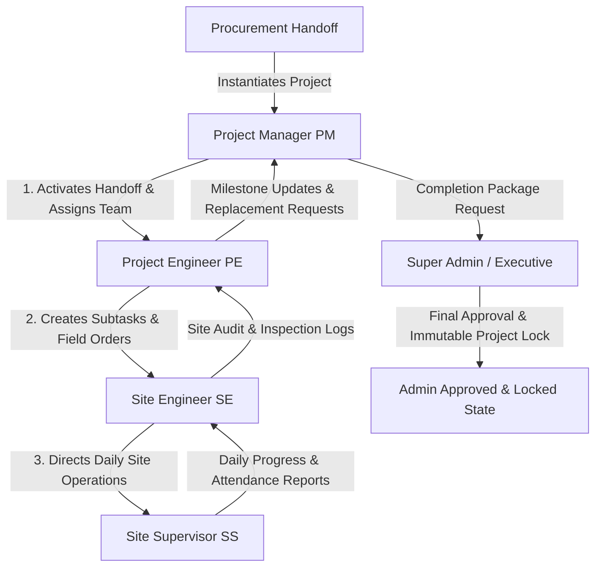

# Production & Field Execution Department Operations & Technical Specification
**Project:** Interior Design & Execution ERP System (Ryphira / Inter-Des)  
**Module:** Production Department (`/src/models/production`, `/src/controllers/production`, `/src/views/production`)  
**Date:** August 21, 2026  
**Document Version:** 1.0.0  

---

## Executive Summary

The **Production & Field Execution Department** is the physical delivery arm of the ERP platform. It is responsible for site readiness, carpentry installation, modular assembly, electrical/plumbing execution, quality checks, site safety, and final client handovers.

Operating under a strict **4-tier field hierarchy (PM $\rightarrow$ PE $\rightarrow$ SE $\rightarrow$ SS)**, the department features automated task cascading, upward completion escalation, daily site attendance check-ins, safety hazard logging, and an **Admin Project Lock Engine** to prevent unauthorized post-handover modifications.

---

## 1. 4-Tier Field Hierarchy & Permission Matrix



### 1.1 Project Manager (`role: 'Project Manager'`, Stage: `PM`)
* Accepts incoming project handoffs from Procurement (`acceptHandoff`).
* Assigns Project Engineers, Site Engineers, and Site Supervisors to the project.
* Manages overall site budget (`budget`, `spent`), Gantt chart timelines, and milestone verification.
* Evaluates staff replacement requests submitted by Project Engineers.
* Submits project completion packages for final Admin approval (`submitProjectCompletion`).

### 1.2 Project Engineer (`role: 'Project Engineer'`, Stage: `PE`)
* Manages technical execution, structural modifications, and engineering compliance on site.
* Creates subtasks (`createSubtask`) and assigns ground operations to Site Engineers.
* Reviews daily site reports and attendance submitted by site supervisors.
* Submits staff replacement requests (`createReplacementRequest`) when labor deficiencies occur.

### 1.3 Site Engineer (`role: 'Site Engineer'`, Stage: `SE`)
* On-site engineering supervision, material receiving verification, and quality assurance (QA).
* Directs Site Supervisors and verifies work completion on the ground.
* Logs site progress reports (`SiteProgressReport`) with uploaded site photos.
* Monitors site safety gear compliance and resolves safety logs (`SafetyLog`).

### 1.4 Site Supervisor (`role: 'Site Supervisor'`, Stage: `SS`)
* Ground-level team leader managing labor forces, carpenters, and trade workers.
* Conducts daily site attendance check-ins (`SiteAttendance`).
* Submits daily supervisor logs (`SupervisorDailyReport`).
* Reports immediate safety hazards (`SafetyLog`).

---

## 2. Operational Lifecycle & Governance

### 2.1 Project Handoff & Activation Lifecycle
$$\text{Planning} \xrightarrow{\text{Accept Handoff}} \text{Active} \xrightarrow{\text{Submit Completion}} \text{Completed} \xrightarrow{\text{Admin Sign-Off}} \text{Admin Approved (Locked)}$$

1. **`Planning` Stage:** Instantiated automatically when Procurement clears materials.
2. **`Active` Stage:** Activated when the Production Manager assigns team members (`acceptHandoff`).
3. **`Completed` Stage:** Reached when all site tasks hit 100% progress and the PM submits completion details (`completionDate`, `finalCost`, `clientRating`, `photos`).
4. **`Admin Approved` (Locked State):** Final executive sign-off. **Locks the project against all edits**.

---

### 2.2 Immutable Project Lock & Unlock Governance (`assertProjectNotLocked`)

To prevent tampering with financial costs, site records, or task histories after project handover, the server enforces a strict write guard:

#### Lock Guard (`assertProjectNotLocked`)
Any backend write attempt (`updateProject`, `createTask`, `assignTask`, `updateTaskStatus`, `createSubtask`) against a project with `status === 'Admin Approved'` returns a `403 Forbidden` error:
> *"This project has been approved and locked by Admin. No further changes are allowed."*

#### Unlock Protocol
If modifications are required post-approval:
1. Field staff submits a formal request: `requestUnlock`.
2. Fires high-priority alerts to all Super Admins & Admins (`🔓 Unlock Request — Production Project`).
3. Admin approves (`unlockProject`) to revert status to `Active`, or rejects (`rejectUnlockRequest`).

---

### 2.3 Task Cascading & Upward Escalation Engine (`productionTaskService.js`)

Tasks move dynamically up and down the 4-tier hierarchy:

#### Downward Assignment & Stage Auto-Switching
When a task is assigned to a user (`assignTask`), the task's operational `stage` automatically updates based on the assignee's role:
* Assignee is `Project Manager` $\implies \text{stage} = \text{'PM'}$
* Assignee is `Project Engineer` $\implies \text{stage} = \text{'PE'}$
* Assignee is `Site Engineer` $\implies \text{stage} = \text{'SE'}$
* Assignee is `Site Supervisor` $\implies \text{stage} = \text{'SS'}$

#### Upward Completion Escalation (`updateTaskStatus`)
When a ground worker marks a task as `Completed`:
1. The engine inspects `assignmentHistory[]` and locates the user who delegated the task.
2. Automatically reassigns the task **upward** to the delegator for verification:
   * `SS` completes task $\implies$ Escalated to `SE`.
   * `SE` completes task $\implies$ Escalated to `PE`.
   * `PE` completes task $\implies$ Escalated to `PM`.
3. If marked `In Progress` again (rejected by superior), it is routed back down to the ground assignee.

---

## 3. Site Governance & Ground Operations

### 3.1 Daily Site Attendance (`SiteAttendance` Model)
Supervisors log worker attendance (`submitAttendance`) recording check-in timestamp, check-out timestamp, GPS location, and status (`Present`, `Absent`, `Half Day`, `Late`, `On Leave`).

### 3.2 Site Progress Reporting (`SiteProgressReport` Model)
Engineers and supervisors record daily accomplishments (`submitDailyReport`) specifying work done, material consumption, delay reasons, worker count, and high-resolution site photographs.

### 3.3 Site Safety Management (`SafetyLog` Model)
Enforces OSHA and site safety standards (`reportSafetyIssue`). Issues are flagged by severity (`Low`, `Medium`, `High`, `Critical`) and status (`Open`, `In Progress`, `Resolved`).

### 3.4 Staff Replacement Requests (`StaffReplacementRequest` Model)
If a team member is underperforming, absent, or needed on another site, Project Engineers submit a replacement request (`createReplacementRequest`). The Production Manager reviews and approves/rejects the transfer.

### 3.5 Immutable Activity Logging (`ProductionActivityLog` Model)
Every site creation, assignment, stage transition, report submission, and lock/unlock action is recorded in `ProductionActivityLog` for forensic auditability.

---

## 4. Data Models & Database Schemas (Production Module)

### 4.1 ProductionProject Schema (`Backend/src/models/production/ProductionProject.js`)
```javascript
{
  projectName: { type: String, required: true },
  clientId: { type: Schema.Types.ObjectId, ref: 'Client' },
  sourceProject: { type: Schema.Types.ObjectId, ref: 'Project' },
  projectType: { type: String, enum: ['Residential', 'Commercial', 'Corporate', 'Other'], default: 'Residential' },
  status: { type: String, enum: ['Planning', 'Active', 'On Hold', 'Completed', 'Admin Approved'], default: 'Planning' },
  startDate: Date,
  endDate: Date,
  projectManager: { type: Schema.Types.ObjectId, ref: 'User', required: true },
  projectEngineer: [{ type: Schema.Types.ObjectId, ref: 'User' }],
  siteEngineer: [{ type: Schema.Types.ObjectId, ref: 'User' }],
  siteSupervisor: [{ type: Schema.Types.ObjectId, ref: 'User' }],
  progress: { type: Number, min: 0, max: 100, default: 0 },
  budget: { type: Number, default: 0 },
  spent: { type: Number, default: 0 },
  completionDetails: {
    completionDate: Date,
    finalCost: Number,
    clientRating: Number,
    finalRemarks: String,
    photos: [String]
  },
  adminApproval: {
    approved: Boolean,
    remarks: String,
    approvedAt: Date,
    approvedBy: { type: Schema.Types.ObjectId, ref: 'User' }
  },
  unlockRequest: {
    requested: { type: Boolean, default: false },
    requestedAt: Date,
    requestedBy: { type: Schema.Types.ObjectId, ref: 'User' }
  }
}
```

### 4.2 ProductionTask Schema (`Backend/src/models/production/ProductionTask.js`)
```javascript
{
  title: { type: String, required: true },
  description: String,
  projectId: { type: Schema.Types.ObjectId, ref: 'ProductionProject', required: true },
  assignedBy: { type: Schema.Types.ObjectId, ref: 'User' },
  assignedTo: { type: Schema.Types.ObjectId, ref: 'User' },
  stage: { type: String, enum: ['PM', 'PE', 'SE', 'SS'], required: true },
  status: { type: String, enum: ['Pending', 'Approved', 'In Progress', 'Completed'], default: 'Pending' },
  priority: { type: String, enum: ['Low', 'Medium', 'High', 'Urgent'], default: 'Medium' },
  parentTask: { type: Schema.Types.ObjectId, ref: 'ProductionTask', default: null },
  isSubtask: { type: Boolean, default: false },
  progress: { type: Number, min: 0, max: 100, default: 0 },
  updates: [{
    log: String,
    images: [String],
    note: String,
    updatedBy: { type: Schema.Types.ObjectId, ref: 'User' },
    timestamp: { type: Date, default: Date.now }
  }],
  comments: [{
    text: { type: String, required: true },
    postedBy: { type: Schema.Types.ObjectId, ref: 'User' },
    createdAt: { type: Date, default: Date.now }
  }],
  assignmentHistory: [{
    assignedTo: { type: Schema.Types.ObjectId, ref: 'User' },
    assignedBy: { type: Schema.Types.ObjectId, ref: 'User' },
    stage: String,
    timestamp: { type: Date, default: Date.now }
  }]
}
```

### 4.3 SiteProgressReport Schema (`Backend/src/models/production/SiteProgressReport.js`)
```javascript
{
  project: { type: Schema.Types.ObjectId, ref: 'ProductionProject', required: true },
  task: { type: Schema.Types.ObjectId, ref: 'ProductionTask' },
  submittedBy: { type: Schema.Types.ObjectId, ref: 'User', required: true },
  workDone: { type: String, required: true },
  delays: String,
  laborCount: { type: Number, default: 0 },
  photos: [String],
  reportDate: { type: Date, default: Date.now }
}
```

### 4.4 SiteAttendance Schema (`Backend/src/models/production/SiteAttendance.js`)
```javascript
{
  project: { type: Schema.Types.ObjectId, ref: 'ProductionProject', required: true },
  staff: { type: Schema.Types.ObjectId, ref: 'User', required: true },
  checkIn: { type: Date, default: Date.now },
  checkOut: Date,
  status: { type: String, enum: ['Present', 'Absent', 'Half Day', 'Late', 'On Leave'], default: 'Present' },
  location: String,
  notes: String
}
```

### 4.5 SafetyLog Schema (`Backend/src/models/production/SafetyLog.js`)
```javascript
{
  project: { type: Schema.Types.ObjectId, ref: 'ProductionProject', required: true },
  reportedBy: { type: Schema.Types.ObjectId, ref: 'User', required: true },
  issueDescription: { type: String, required: true },
  severity: { type: String, enum: ['Low', 'Medium', 'High', 'Critical'], default: 'Medium' },
  status: { type: String, enum: ['Open', 'In Progress', 'Resolved'], default: 'Open' },
  actionTaken: String,
  resolvedAt: Date
}
```

---

## 5. API Endpoints Reference

### 5.1 Project & Control APIs (`/api/production-management`)

| Method | Endpoint | Description | Auth Roles Allowed |
| :--- | :--- | :--- | :--- |
| `GET` | `/api/production-management/projects` | List production projects | Production Staff, Admin |
| `GET` | `/api/production-management/projects/handoff` | List incoming handoffs awaiting activation | Project Manager, Admin |
| `PUT` | `/api/production-management/projects/:id/accept-handoff` | PM accepts handoff & assigns initial team | Project Manager |
| `PUT` | `/api/production-management/projects/:id/assign-team` | Reassign project engineers/supervisors | Project Manager |
| `POST` | `/api/production-management/projects/:id/complete` | Submit project completion package | Project Manager |
| `PUT` | `/api/production-management/projects/:id/admin-approve` | Superadmin final sign-off & lock project | Super Admin, Admin |
| `POST` | `/api/production-management/projects/:id/request-unlock` | Request unlock for locked project | Project Staff |
| `PUT` | `/api/production-management/projects/:id/unlock` | Admin unlocks project for editing | Super Admin, Admin |

---

### 5.2 Task & Ground APIs (`/api/production-management`)

| Method | Endpoint | Description | Auth Roles Allowed |
| :--- | :--- | :--- | :--- |
| `POST` | `/api/production-management/tasks/create` | Create production task | Project Manager, Engineer |
| `PUT` | `/api/production-management/tasks/:taskId/assign` | Assign task (auto-switches stage) | Project Manager, Engineer |
| `PUT` | `/api/production-management/tasks/:taskId/update-status` | Update status (auto-escalates upward on completion) | Assigned User |
| `POST` | `/api/production-management/engineer/subtask` | Create subtask under parent task | Project Engineer |
| `POST` | `/api/production-management/site/attendance` | Log daily worker site attendance | Field Engineers & Supervisors |
| `POST` | `/api/production-management/site/safety` | Report site safety issue | Field Engineers & Supervisors |
| `POST` | `/api/production-management/site/reports` | Submit daily site progress report | Field Engineers & Supervisors |
| `POST` | `/api/production-management/projects/:id/replacement-request` | Submit staff replacement request | Project Engineer |

---

## 6. Frontend Role-Specific Workspace Views

The Production frontend is partitioned into four role-tailored portal views under `AppRoutes.jsx`:

1. **Project Manager Workspace (`/views/production/project_manager`):**
   * High-level Gantt chart, budget allocation, handoff activation studio, task board, and completion approval package submission.
2. **Project Engineer Workspace (`/views/production/project_engineer`):**
   * Technical project detail view, subtask creator, staff replacement manager, engineer report reviewer, and leave requester.
3. **Site Engineer Workspace (`/views/production/site_engineer`):**
   * Ground task execution board, daily site progress report logger, safety issue manager, and staff attendance checker.
4. **Site Supervisor Workspace (`/views/production/site_supervisor`):**
   * Simplified mobile-friendly ground interface for daily attendance check-ins, supervisor daily reports, and immediate hazard alerts.
