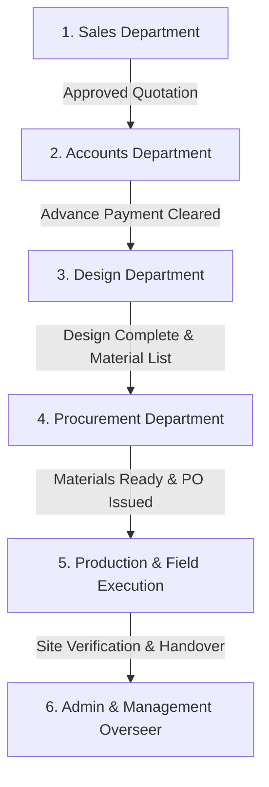
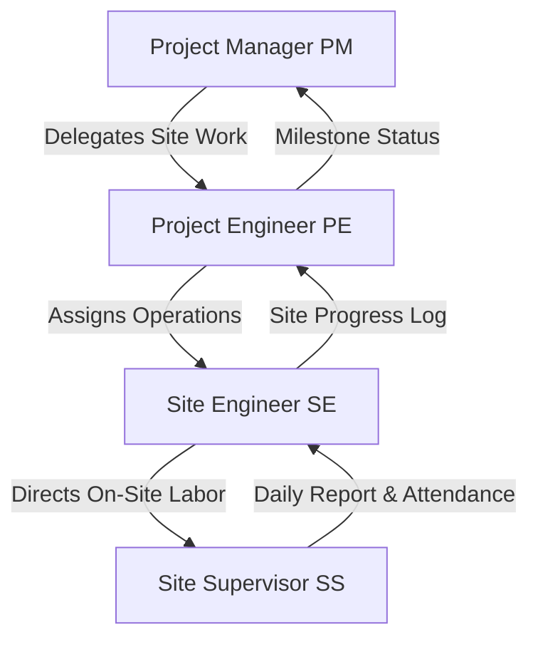

# System Architecture & Cross-Departmental Data Flow Documentation
**Project:** Interior Design & Execution ERP System (Ryphira / Inter-Des)  
**Date:** August 21, 2026  
**Document Version:** 1.0.0  

---

## Executive Summary

The **Interior Design & Execution ERP System** is an end-to-end enterprise platform engineered specifically for modern interior design and turn-key execution firms. The system integrates six primary enterprise departments (**Sales, Accounts, Design, Procurement, Production, and Administration**) into a unified, event-driven data flow. 

By replacing disjointed spreadsheets and manual messaging with automated workflow validation, real-time push notifications, and structured approval gates, the platform tracks a project from initial client inquiry to final handover with full transparency and auditability.

---

## 1. High-Level Technology Architecture

### 1.1 Tech Stack Overview
```
+-----------------------------------------------------------------------+
|                           FRONTEND LAYER                              |
|   React (Vite) | Redux Toolkit (RTK Query) | Lucide Icons | CSS3     |
+-----------------------------------------------------------------------+
                                   |
                          REST API / JSON / JWT
                                   v
+-----------------------------------------------------------------------+
|                           BACKEND LAYER                               |
|  Node.js + Express (ES Modules) | Express Rate Limiter | Helmet | CORS|
+-----------------------------------------------------------------------+
        |                          |                         |
        v                          v                         v
+---------------+        +------------------+       +-------------------+
|  MongoDB      |        |  Notification    |       | Edge Band Matcher |
|  Database     |        |  & Deadline Engine|       | & AI Engine       |
+---------------+        +------------------+       +-------------------+
```

* **Frontend:** React 18 built with Vite, utilizing Redux Toolkit with RTK Query for backend API state management, standard CSS design tokens, and Framer Motion micro-interactions.
* **Backend:** Node.js runtime with Express API framework using modern ES module imports (`import`/`export`), Mongoose ODM, Helmet security policies, compression, rate-limiting (`express-rate-limit`), and CORS.
* **Database:** MongoDB (Atlas/Local) utilizing standard collections, text indexes, schema pre-save middleware hooks for auto-increment IDs, and compound indexes.
* **Authentication:** Dual JWT authentication system (Standard internal user JWT + dedicated Client Portal token auth).

---

## 2. User Roles & Permission Matrix

The system implements a granular role-based access control (RBAC) model across 16 user roles:

| Role Category | Role Name | Primary Responsibilities & Access Scope |
| :--- | :--- | :--- |
| **Executive / Admin** | `Super Admin`, `Admin`, `Manager` | Full system governance, staff management, financial reports, settings, meeting scheduling, milestone tracking. |
| **Sales** | `Sales` | Client onboarding, site visit recording, creating & revising Quotations, tracking lead conversion. |
| **Accounts** | `Accounts Manager`, `Accounts Staff` | Verifying advance payments, issuing Invoices, recording Payments, expense tracking, approving budget releases. |
| **Design** | `Design Manager`, `Design Staff` | Managing design projects, task allocation, Edge Band matching, 2D/3D design submissions, design approvals. |
| **Procurement** | `Procurement Manager`, `Procurement Staff` | Processing Material Requests, Vendor onboarding, Vendor quote comparisons, Purchase Order (PO) creation, inventory level management. |
| **Production** | `Project Manager (PM)` | Project handoff verification, scheduling production tasks, team assignment, site safety supervision, final admin sign-off. |
| **Field Execution** | `Project Engineer (PE)`, `Site Engineer (SE)`, `Site Supervisor (SS)` | Executing site tasks, daily progress logging, site attendance check-ins, staff replacement requests, safety reporting. |
| **Client** | `Client` | External portal access: viewing design progress, quotation approval, invoice payment status, edge band selection review. |

---

## 3. Departmental Breakdown & Working Details



---

### 3.1 Sales Department

#### Primary Responsibilities
* Client relationship management (CRM) & lead lifecycle tracking.
* Conducting initial site visits and logging spatial notes & images.
* Drafting detailed itemized **Quotations (BOQs)** with custom pricing, discounts, and section groupings.
* Managing revision cycles and securing client approvals.

#### Operational Workflow & Data Flow
1. **Client Registration:** Sales rep enters client details (`Client` model), including site address, billing info, and primary contact details.
2. **Site Visit:** Sales logs a `SiteVisit` entry containing notes, location data, and uploaded site photos.
3. **Quotation Generation (`Quotation` model):**
   * Items are organized by sections (e.g., *Living Room, Master Bedroom, Kitchen*).
   * Calculates dimensions (CM Length, Depth, Height, SQFT), quantity, cost price, and markup rates.
   * **Calculated Pricing Engine:**
     $$\text{Item Amount} = (\text{Quantity} \times \text{Rate}) - \text{Discount}$$
     $$\text{Subtotal} = \sum \text{Section Totals} - \text{Category Discounts}$$
     $$\text{Tax Amount} = \text{Offer Price} \times \left(\frac{\text{Tax Rate}}{100}\right)$$
     $$\text{Total Amount} = \text{Offer Price} + \text{Tax Amount}$$
4. **Version Control:** Edits to a quotation automatically archive previous states into `versions[]` array while updating `currentVersion`.
5. **Approval Routing:** Once approved by client, quotation status shifts to `Approved` or `Material Approved`, triggering Project creation in Accounts/Design.

---

### 3.2 Accounts Department

#### Primary Responsibilities
* Validating advance deposit payment conditions before project kickoff.
* Generating customer-facing Invoices linked to approved Quotations.
* Processing payments (Cash, UPI, NEFT, RTGS, Cheque, Card).
* Recording vendor expenses and monitoring company overheads.

#### Operational Workflow & Data Flow
1. **Project Initiation Gate:** Receives alert for new project requiring advance payment collection (`Project.paymentStatus = 'Pending Advance'`).
2. **Payment Collection (`Payment` model):**
   * Accounts staff verifies receipt of funds and updates `collectedAmount` & `advanceAmount`.
   * When advance criteria is satisfied, the project stage transitions automatically to **Design** (`Project.stage = 'Design'`).
3. **Invoicing (`Invoice` model):**
   * Auto-generates `INV-YYYY-XXX` linked to `Client`, `Quotation`, and `Project`.
   * Monitors due dates and automatically updates status to `Paid`, `Partially Paid`, or `Overdue`.
4. **Expense Tracking (`Expense` model):**
   * Logs project costs under categories (*Material, Labor, Transport, Equipment, Consultation, Overhead*).
   * Computes net profit margin per project:
     $$\text{Net Profit} = \text{Invoice Revenue} - \text{Total Expenses}$$

---

### 3.3 Design Department

#### Primary Responsibilities
* Space planning, 2D drafting, 3D visualization, and material specification.
* Edge Band selection and fuzzy matching algorithm integration.
* Collaborative design reviews and checklist verification.

#### Operational Workflow & Data Flow
1. **Design Task Allocation (`Task` model):**
   * Design Manager assigns design tasks to `Design Staff` with creative requirements, estimated hours, and target due dates.
   * Uses Kanban boards (`To Do` $\rightarrow$ `In Progress` $\rightarrow$ `Review Pending` $\rightarrow$ `Completed`).
2. **Edge Band Selection & Fuzzy Matcher (`EdgeBand` & `EdgeBandSelection` models):**
   * Designer inputs raw material codes (e.g., laminate codes).
   * **`edgeBandMatcher.js` Utility:** Performs Levenshtein distance & fuzzy string matching against stored `EdgeBand` inventory codes. Returns candidates with match score percentage ($\ge 70\%$).
   * Stores selected edge band items in `EdgeBandSelection` linked to the project and dimension standard (`22x0.8`, `22x2`, `45x0.8`, `45x2`).
3. **Submissions & Revisions:**
   * Staff uploads 2D/3D files in `submissions[]`. Manager reviews and marks `Approved` or `Revision Required`.
4. **Design Handoff Gate:**
   * `workflowValidationService.js` validates that all design tasks are 100% complete and approved before pushing materials to Procurement (`Project.designComplete = true`).

---

### 3.4 Procurement Department

#### Primary Responsibilities
* Fulfilling material requirements generated by Design or field teams.
* Vendor relationship management and quotation comparisons.
* Generating Purchase Orders (POs) and monitoring stock levels in real time.

#### Operational Workflow & Data Flow
1. **Material Requests (`MaterialRequest` model):**
   * Receives auto-pushed material lists (`isPushedFromDesign = true`) or site requests from field engineers.
   * Auto-generates request numbers (`MR-YYYY-XXXX`).
2. **Vendor Comparison (`VendorComparison` model):**
   * Collects quotes from multiple `Vendor` entities for requested items.
   * Compares pricing, delivery timelines, and payment terms (`Net 15`, `Net 30`, `Net 60`).
   * Selects winning vendor and marks selected quote.
3. **Purchase Orders (`PurchaseOrder` model):**
   * Issues PO (`PO-YYYY-XXX`) specifying items, rates, delivery location, and expected delivery date.
   * Upon receipt of goods, updates `receivedQuantity` on PO items.
4. **Inventory & PO Inventory (`Inventory` & `POInventory` models):**
   * Stocks items and monitors `reorderLevel`.
   * Automatically calculates stock status:
     $$\text{Status} = \begin{cases} \text{Out of Stock} & \text{if } \text{stock} = 0 \\ \text{Low Stock} & \text{if } 0 < \text{stock} \le \text{reorderLevel} \\ \text{In Stock} & \text{if } \text{stock} > \text{reorderLevel} \end{cases}$$
5. **Procurement Completion Gate:** Once all materials are received on-site, `Project.materialsReady = true`, signaling readiness for Production.

---

### 3.5 Production & Field Execution Department

#### Primary Responsibilities
* Turnkey site execution, carpentry, electrical, plumbing, finishing, and installation.
* Hierarchical task delegation across 4 field tiers.
* Daily attendance, safety logging, site progress reports, and staff replacement handling.



#### Field Hierarchy & Task Flow (`ProductionTask` & `ProductionProject` models)
* **Project Manager (PM):** Overall site budget, high-level milestone approval, project completion request.
* **Project Engineer (PE):** Structural & technical oversight, approving supervisor daily reports, requesting staff replacements.
* **Site Engineer (SE):** Quality checks, material inspection on site, managing site supervisors.
* **Site Supervisor (SS):** Ground-level operations, logging `SiteAttendance`, submitting `SupervisorDailyReport` and `SafetyLog`.

#### Operational Workflow
1. **Production Project Creation:** Prompts handoff from Procurement (`ProductionProject` model created from `sourceProject`).
2. **Task Cascading:** Tasks move through stages (`PM` $\rightarrow$ `PE` $\rightarrow$ `SE` $\rightarrow$ `SS`). Progress percentage is tracked dynamically.
3. **Daily Site Logging:**
   * **`SiteProgressReport`:** Images, completed items, delays, labor count.
   * **`SafetyLog`:** Incident reporting, safety gear compliance, hazard alerts.
   * **`SiteAttendance`:** Daily labor/staff check-in.
4. **Project Completion & Admin Lock:**
   * PM requests completion (`status = 'Completed'`).
   * Final sign-off by Admin locks project (`status = 'Admin Approved'`).
   * Lock can only be re-opened via an explicit `unlockRequest`.

---

### 3.6 Admin & Executive Management

#### Primary Responsibilities
* System-wide monitoring and governance.
* Staff administration (`Staff` model with full salary structure breakdown: Base, HRA, Travel Allowance, PF, Tax deductions).
* Team structures (`Team` model) and staff report tracking (`StaffReport`).
* Meeting scheduling (`Meeting` model) with auto-computed live status (`upcoming`, `ongoing`, `completed`).
* Master milestone management across all company projects (`milestonesRoutes.js`).
* Comprehensive system audit logging (`AuditLog` model).

---

## 4. End-to-End Project Data Flow & Lifecycle

```
[CLIENT INQUIRY] 
       │
       ▼
[SALES] ──────────► Register Client ──► Site Visit ──► Draft Quotation (QT-YYYY-XXXX)
       │                                                      │
       │                                             Client Approves Quotation
       ▼                                                      │
[ACCOUNTS] ───────► Receive Project (PRJ-YYYY-XXXX) ◄─────────┘
       │                 │
       │           Collect Advance Payment
       ▼                 │
[DESIGN] ◄───────────────┘ (Project Stage: Design)
       │
       ├─► Create Design Tasks (2D/3D)
       ├─► Perform Edge Band Matching & Selection
       └─► Mark Design Complete & Approve Handoff
                         │
                         ▼
[PROCUREMENT] ◄──────────┘ (Project Stage: Procurement)
       │
       ├─► Process Material Request (MR-YYYY-XXXX)
       ├─► Vendor Quote Comparison (VC-YYYY-XXXX)
       ├─► Issue Purchase Order (PO-YYYY-XXXX)
       └─► Receive Items & Update Inventory Status
                         │
                         ▼
[PRODUCTION] ◄───────────┘ (Project Stage: Production)
       │
       ├─► Handoff to Production Project
       ├─► Cascade Tasks (PM ──► PE ──► SE ──► SS)
       ├─► Submit Daily Reports, Attendance & Safety Logs
       └─► Submit Completion Request
                         │
                         ▼
[ADMIN] ──────────► Final Review & Project Lock (Handover Complete)
```

---

## 5. System Data Dictionary & Core Models

### Core Collections & Keys

```
Client (_id, name, email, phone, siteAddress, billingAddress, status, createdBy)
  │
  ├── Quotation (_id, quotationNumber, client, items[], subtotal, offerPrice, taxAmount, totalAmount, status, versions[])
  │     │
  │     └── Invoice (_id, invoiceNumber, client, quotation, project, grandTotal, amountPaid, status)
  │
  └── Project (_id, projectNumber, client, quotation, stage, status, progress, designComplete, materialsReady, productionComplete)
        │
        ├── Task (_id, title, project, assignedTo[], status, priority, dueDate, submissions[], comments[])
        │
        ├── EdgeBandSelection (_id, project, brand, enteredCode, matchedCode, matchPercentage, dimension, quantity)
        │
        ├── MaterialRequest (_id, requestNumber, project, items[], status, assignedTo, approvedBudget)
        │     │
        │     └── VendorComparison (_id, comparisonNumber, materialRequest, quotes[], selectedVendor)
        │           │
        │           └── PurchaseOrder (_id, poNumber, supplier, items[], totalAmount, status)
        │
        └── ProductionProject (_id, projectName, sourceProject, projectManager, progress, status, adminApproval)
              │
              ├── ProductionTask (_id, title, projectId, stage, status, assignedTo, progress)
              ├── SiteProgressReport (_id, project, supervisor, workDone, photos[])
              └── SiteAttendance (_id, project, staff, checkIn, checkOut, status)
```

---

## 6. Automation & Background Engines

### 6.1 Task Deadline Checker (`notificationHelper.js`)
* Runs periodically (every 60 minutes) on the server.
* Scans all incomplete tasks (`Task` model) against current timestamp:
  * **Due in $\le 24$ hrs:** Triggers `Warning` notification ("Task Due Soon").
  * **Due in $\le 48$ hrs:** Triggers `Info` notification ("Task Deadline Approaching").
  * **Past due date:** Marks `isOverdue = true` and fires `Error` alert ("Task Overdue").

### 6.2 Workflow Validation Service (`workflowValidationService.js`)
* Enforces structural state transitions on Projects (`Not Started` $\rightarrow$ `In Progress` $\rightarrow$ `On Hold` $\rightarrow$ `Completed`).
* **Handoff Gatekeeper (`validateHandoff`):** Blocks project handoff from Design to Procurement/Production unless:
  1. All design tasks are 100% completed.
  2. No critical pending revisions exist.
  3. An approved quotation is linked.
  4. No unresolved material requests remain.

### 6.3 Fuzzy Edge Band Matcher (`edgeBandMatcher.js`)
* Normalizes input text strings (removing spaces, hyphens, non-alphanumeric chars).
* Calculates similarity score using Levenshtein distance:
  $$\text{Similarity} = \left(1 - \frac{\text{LevenshteinDistance}(s_1, s_2)}{\max(\text{len}(s_1), \text{len}(s_2))}\right) \times 100$$
* Filters results $\ge 70\%$ match score to assist interior designers in instantly identifying matching edge band codes across different vendor databases.

---

## 7. Frontend Navigation & View Architecture

The frontend is logically segregated into three main routing branches managed by `AppRoutes.jsx` & `ClientRoutes.jsx`:

1. **Admin Layout (`/`):**
   * Accessible by Admins, Managers, Design Managers, and Production Engineers.
   * Views: Dashboard, Projects, Quotations, Invoices, Tasks, Material Review, Staff, Inventory, POs, Meetings, Admin Reports, Milestones, Settings.
2. **Staff Layout (`/staff/*`):**
   * Operational view for department staff (Sales reps, Design staff).
   * Views: Staff Dashboard, Assigned Tasks, Completed Tasks, Client List, Quotation Creator, Site Visit Logger, Staff Reports.
3. **Procurement Dedicated Layout (`/` for Procurement Roles):**
   * Dedicated workspace for Procurement Managers and Procurement Staff.
   * Views: Material Request Queue, Vendor Comparison Studio, PO Generator, Stock & PO Inventory Tracker.
4. **Client Portal (`/client/*`):**
   * Token-authenticated external view for end customers.
   * Views: Project Timeline Progress, Quotation Approval Interface, Invoice & Payment Portal, Design Proofing.

---

## Conclusion

This project architecture provides a robust, scalable foundation for interior design business operations. By linking customer quotations directly to accounts, design tasks, material procurement, and field execution, the system eliminates administrative friction, enforces strict financial and quality compliance, and delivers full project visibility across all departments.
