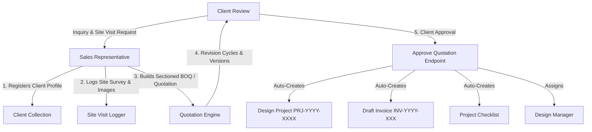

# Sales Department Operations & Technical Specification
**Project:** Interior Design & Execution ERP System (Ryphira / Inter-Des)  
**Module:** Sales Department (`/src/models/sales`, `/src/controllers/sales`, `/src/views/sales`)  
**Date:** August 21, 2026  
**Document Version:** 1.0.0  

---

## Executive Summary

The **Sales Department** is the primary revenue-generating and client onboarding gateway of the ERP platform. It manages client leads, logs initial site visits, drafts itemized **Bill of Quantities (BOQ) / Quotations**, manages version histories, handles category-level discounts and tax rules, and secures client approvals.

When a quotation is approved, the Sales module automatically instantiates the main **Project** record, sets its initial stage to **`Design`**, drafts the customer **Invoice**, populates default project checklists, and notifies the assigned **Design Manager** to commence work.

---

## 1. Sales Department Roles & Hierarchy



### 1.1 Sales Representative (`role: 'Sales'`)
* Registers new client profiles (`Client` model) with site, contact, and billing details.
* Performs site surveys and logs notes, dimensions, and site photos (`SiteVisit` model).
* Creates itemized quotations organized by architectural sections (Living Room, Kitchen, Bedrooms).
* Manages quotation revisions based on client budget constraints.
* Presents final 2D/3D design proofs (reviewed by Design Manager) to clients for sign-off.

### 1.2 Sales Manager / Admin (`role: 'Super Admin'`, `'Admin'`, `'Manager'`)
* Monitors sales pipelines, lead conversion rates, and profit margin statistics.
* Approves custom category discounts or price overrides.
* Assigns incoming approved projects to specific **Design Managers**.

---

## 2. Core Functional Modules & Financial Engines

### 2.1 Client Onboarding & Role Filtering (`Client` Model)

Stores client metadata:
* **Contact Information:** `name`, `email`, `phone`, `contact1`, `contact2`, `dateOfBirth`.
* **Addresses:** `address`, `siteAddress`, `billingAddress`, `billingPincode`.
* **Status:** `Active`, `Inactive`, `Archived`.
* **Role-Based Isolation Guard (`getClients`):** For general `Staff` users, the controller dynamically restricts client listing to only clients linked to tasks assigned to that staff member.

---

### 2.2 Site Visit Logger (`SiteVisit` Model)
Captures pre-design site conditions:
* Links `staff`, `client`, optional `task`, and `quotation`.
* Stores GPS location, spatial notes, visit date, and uploaded site photographs (`images[]`).

---

### 2.3 Quotation & Financial Pricing Engine (`Quotation` Model)

The Quotation engine generates unique sequential IDs (`QT-YYYY-XXXX`) and computes complex sub-totals, discounts, profit margins, and taxes via a pre-save hook.

#### 1. Sectioned Item Breakdown (`QuotationItemSchema`)
Items are grouped into spatial sections (*e.g., Living Room, Master Bedroom, Modular Kitchen*). Each item stores:
* Measurements: Length (`cmL`), Depth (`cmD`), Height (`cmH`), Total Area (`sqft`).
* Unit: `SCM`, `sqft`, `pieces`, `sheets`, etc.
* Cost Price (`costPrice`), Selling Rate (`rate`), Quantity (`quantity`).

#### 2. Pre-Save Mathematical Calculation Engine
Before saving to MongoDB, `Quotation.js` automatically computes all financial metrics:

$$\text{Item Base Amount} = \text{Quantity} \times \text{Rate}$$

$$\text{Item Discount Amount} = \begin{cases} \text{discountValue} & \text{if type is 'amount'} \\ \frac{\text{Item Base Amount} \times \text{discountValue}}{100} & \text{if type is 'percentage'} \end{cases}$$

$$\text{Item Final Amount} = \text{Item Base Amount} - \text{Item Discount Amount}$$

$$\text{Item Profit} = \text{Item Final Amount} - (\text{Quantity} \times \text{Cost Price})$$

$$\text{Total Cost} = \sum (\text{Quantity} \times \text{Cost Price})$$

#### 3. Category & Section Discounting
Items are grouped by `section` to compute section subtotals:
$$\text{Category Subtotal} = \sum_{i \in \text{Section}} \text{Item Final Amount}_i$$
$$\text{Calculated Subtotal} = \sum (\text{Category Subtotal} - \text{Category Discount})$$

#### 4. Offer Price, Profit Margin & Tax
$$\text{Offer Price} = \text{Subtotal} - \left(\frac{\text{Subtotal} \times \text{Overall Discount \%}}{100}\right)$$

$$\text{Total Profit} = \text{Offer Price} - \text{Total Cost}$$

$$\text{Profit Margin \%} = \begin{cases} \left(\frac{\text{Total Profit}}{\text{Offer Price}}\right) \times 100 & \text{if Offer Price} > 0 \\ 0 & \text{otherwise} \end{cases}$$

$$\text{Tax Amount} = \text{Offer Price} \times \left(\frac{\text{Tax Rate}}{100}\right)$$

$$\text{Total Amount} = \text{Offer Price} + \text{Tax Amount}$$

---

### 2.4 Quotation Versioning & Revisions (`versions[]` & `currentVersion`)

Whenever an existing quotation's item list is updated (`updateQuotation`):
1. A deep copy snapshot of the current state (`version`, `items`, `categoryDiscounts`, `subtotal`, `taxAmount`, `totalAmount`) is pushed into the `versions[]` array.
2. `currentVersion` is incremented by 1.
3. Allows full auditability and comparison across client negotiation rounds.

---

### 2.5 Automated Project Creation Gate (`approveQuotation`)

When a quotation is marked as `Approved` (`status = 'Approved'`):
1. **Quotation Status:** Updated to `Approved` with `approvedBy` and `approvedAt` timestamps.
2. **Main Project Auto-Creation (`Project` Model):**
   * Generates project number: `PRJ-YYYY-XXXX`.
   * Sets initial stage to **`Design`** (`Project.stage = 'Design'`).
   * Sets initial payment status to `Pending Advance`.
   * Sets `advanceAmount = Total Amount \times 0.5` (default 50% target).
   * Assigns designated **Design Manager** (`assignedDesignManager`).
3. **Draft Invoice Auto-Creation (`Invoice` Model):**
   * Generates invoice number: `INV-YYYY-XXX`.
   * Maps all quotation items into invoice line items.
   * Sets due date to $+15$ days from creation.
4. **Default Checklist Auto-Creation (`Checklist` Model):**
   * Auto-populates standard interior project milestones:
     1. Demolition
     2. Cleaning
     3. Installation
     4. Final Handover
5. **Notifications:** Fires alerts to the assigned Design Manager (`🎨 New Project Assigned for Design`).

---

## 3. Data Models & Database Schemas (Sales Module)

### 3.1 Client Schema (`Backend/src/models/sales/Client.js`)
```javascript
{
  name: { type: String, required: true, trim: true },
  email: { type: String, required: true, lowercase: true },
  projectName: String,
  phone: String,
  address: String,
  siteAddress: String,
  billingAddress: String,
  billingPincode: String,
  contact1: String,
  contact2: String,
  dateOfBirth: Date,
  status: { type: String, enum: ['Active', 'Inactive', 'Archived'], default: 'Active' },
  notes: String,
  createdBy: { type: Schema.Types.ObjectId, ref: 'User', required: true }
}
```

### 3.2 Quotation Schema (`Backend/src/models/sales/Quotation.js`)
```javascript
{
  quotationNumber: { type: String, required: true, unique: true }, // e.g. QT-2026-0001
  client: { type: Schema.Types.ObjectId, ref: 'Client', required: true },
  projectName: { type: String, required: true },
  projectType: { type: String, enum: ['Residential', 'Commercial', 'Hospitality', 'Retail', 'Other'], default: 'Residential' },
  clientPhone: String,
  items: [{
    itemName: { type: String, required: true },
    description: String,
    section: String,
    finish: String,
    material: String,
    unit: { type: String, default: 'SCM' },
    size: String,
    cmL: Number, cmD: Number, cmH: Number, sqft: Number,
    quantity: { type: Number, required: true },
    costPrice: { type: Number, default: 0 },
    rate: { type: Number, required: true },
    amount: { type: Number, required: true },
    discountType: { type: String, enum: ['percentage', 'amount'], default: 'percentage' },
    discountValue: { type: Number, default: 0 },
    discountAmount: { type: Number, default: 0 },
    profit: { type: Number, default: 0 }
  }],
  categoryDiscounts: [{
    category: { type: String, required: true },
    discountType: { type: String, enum: ['percentage', 'amount'], default: 'percentage' },
    discountValue: { type: Number, default: 0 }
  }],
  subtotal: { type: Number, default: 0 },
  totalCost: { type: Number, default: 0 },
  totalProfit: { type: Number, default: 0 },
  profitMargin: { type: Number, default: 0 },
  taxRate: { type: Number, default: 18 },
  taxAmount: { type: Number, default: 0 },
  discount: { type: Number, default: 0 },
  offerPrice: Number,
  totalAmount: { type: Number, required: true },
  status: {
    type: String,
    enum: ['Draft', 'Under Review', 'Revision', 'Design Approved', 'Material Approved', 'Sent to Procurement', 'Sent to Accounts', 'Approved', 'Rejected', 'Expired'],
    default: 'Draft'
  },
  validUntil: Date,
  version: { type: Number, default: 1 },
  currentVersion: { type: Number, default: 1 },
  versions: [QuotationVersionSchema],
  createdBy: { type: Schema.Types.ObjectId, ref: 'User', required: true }
}
```

### 3.3 Invoice Schema (`Backend/src/models/sales/Invoice.js`)
```javascript
{
  invoiceNumber: { type: String, required: true, unique: true }, // e.g. INV-2026-001
  client: { type: Schema.Types.ObjectId, ref: 'Client', required: true },
  quotation: { type: Schema.Types.ObjectId, ref: 'Quotation' },
  project: { type: Schema.Types.ObjectId, ref: 'Project' },
  invoiceDate: { type: Date, default: Date.now },
  dueDate: { type: Date, required: true },
  items: [{
    description: { type: String, required: true },
    quantity: { type: Number, required: true },
    rate: { type: Number, required: true },
    tax: { type: Number, default: 18 },
    amount: { type: Number, required: true }
  }],
  subtotal: { type: Number, required: true },
  totalTax: { type: Number, default: 0 },
  grandTotal: { type: Number, required: true },
  amountPaid: { type: Number, default: 0 },
  status: {
    type: String,
    enum: ['Draft', 'Sent', 'Paid', 'Unpaid', 'Overdue', 'Partially Paid', 'Cancelled'],
    default: 'Draft'
  },
  createdBy: { type: Schema.Types.ObjectId, ref: 'User', required: true }
}
```

---

## 4. API Endpoints Reference

### 4.1 Client Management Routes (`/api/clients`)

| Method | Endpoint | Description | Auth Roles Allowed |
| :--- | :--- | :--- | :--- |
| `GET` | `/api/clients` | Fetch list of clients (search, status, role-isolated for staff) | All Authenticated Users |
| `POST` | `/api/clients` | Create new client profile | Sales, Admin |
| `GET` | `/api/clients/:id` | Get detailed client profile | All Authenticated Users |
| `PUT` | `/api/clients/:id` | Update client information | Sales, Admin |
| `DELETE` | `/api/clients/:id` | Delete client record | Super Admin, Admin |
| `GET` | `/api/clients/stats` | Get client summary stats | Sales, Admin |

---

### 4.2 Quotation Management Routes (`/api/quotations`)

| Method | Endpoint | Description | Auth Roles Allowed |
| :--- | :--- | :--- | :--- |
| `GET` | `/api/quotations` | Fetch all quotations | Sales, Design Manager, Admin |
| `POST` | `/api/quotations` | Create new quotation (auto-generates `QT-YYYY-XXXX`) | Sales, Admin |
| `PUT` | `/api/quotations/:id` | Update quotation (creates version snapshot if items change) | Sales, Admin |
| `DELETE` | `/api/quotations/:id` | Delete quotation | Super Admin, Admin |
| `POST` | `/api/quotations/:id/approve` | Approve quotation & auto-instantiate Project, Invoice, & Checklist | Sales Manager, Admin |
| `POST` | `/api/quotations/calculate` | Stateless pricing calculation helper | Sales, Admin |

---

## 5. Frontend View & Layout Architecture

The Sales module operates under `SalesLayout.jsx` for department staff and general admin views for management:

1. **`SalesDashboard.jsx` (`/src/views/sales`):**
   * Overview of active leads, pending quotations, site visits, and completed sales tasks.
2. **`SalesNewQuotation.jsx` (`/src/views/sales`):**
   * Interactive BOQ builder allowing real-time section creation, dimension calculations, discount rules, and instant financial totals preview.
3. **`SalesQuotationView.jsx` (`/src/views/sales`):**
   * Customer-facing presentation view with PDF export capabilities, version history timeline dropdown, and approval action controls.
4. **`SiteVisit.jsx` (`/src/views/sales`):**
   * Interface to record initial site survey measurements, spatial notes, and upload pre-design site photographs.
