# Interior Design ERP System

This is a comprehensive ERP system tailored for an Interior Design & Manufacturing firm. It streamlines the entire process from initial quotation and client approval through design, procurement, and final production.

## System Architecture

The application is built using a modern MERN stack:
- **Frontend:** React (Vite), React Router, Context API, CSS
- **Backend:** Node.js, Express.js
- **Database:** MongoDB (Mongoose ODM)
- **Authentication:** JWT-based role-based access control (RBAC)

## Multi-Level Workflow & Pipeline

The system is designed around a strict sequential pipeline that guarantees accountability and structured handoffs between departments.

### Workflow Flowchart

```mermaid
graph TD
    %% Quotation Phase
    A[Sales / Staff<br/>Generates Quotation<br/>/staff/quotations/new] --> B[Sales & Client<br/>Sales Approvals System<br/>/staff/approvals]
    B --> C[Super Admin<br/>Reviews & Creates Project<br/>/projects]
    
    %% Design Pipeline
    C --> D[Design Manager<br/>Assigns Design Tasks<br/>/material-review]
    D --> E[Design Staff<br/>Submits Visual Assets<br/>/material-review]
    E --> F{Design Manager<br/>Review}
    F -->|Reject| E
    F -->|Approve| G{Super Admin<br/>Design Approvals Hub<br/>/approvals}
    G -->|Reject| E
    
    %% Procurement Pipeline
    G -->|Approve| H[Procurement Staff<br/>Sources Vendors & Materials<br/>Procurement Dashboard]
    H --> I{Procurement Manager<br/>Review Pricing<br/>Procurement Dashboard}
    I -->|Reject| H
    I -->|Approve| J{Super Admin<br/>Procurement Approvals Hub<br/>/approvals}
    J -->|Reject| H
    
    %% Production Pipeline
    J -->|Approve & Assign PM| K[Project Manager<br/>Receives Handoff<br/>/production-management/handoff]
    K --> L[Project Manager<br/>Assigns Team & Activates<br/>/production-management/tasks]
    L --> M[Production Team<br/>Task Execution<br/>/engineer/tasks & /site/tasks]
    M --> N{PM / Engineer<br/>Production Approvals System<br/>/production-management/approvals}
    N -->|Reject| M
    N -->|Approve| O[Project Manager<br/>Project Completion<br/>.../projects/:id/complete]

    classDef admin fill:#4f46e5,stroke:#312e81,stroke-width:2px,color:#fff;
    classDef manager fill:#10b981,stroke:#047857,stroke-width:2px,color:#fff;
    classDef staff fill:#f8fafc,stroke:#94a3b8,stroke-width:2px,color:#1e293b;
    classDef client fill:#f59e0b,stroke:#b45309,stroke-width:2px,color:#fff;

    class A,E,H,M staff;
    class D,F,I,K,L manager;
    class C,G,J admin;
    class B,N,O client;
```



### 1. Quotation & Initiation Phase
- **Sales / Staff:** Generates a quotation for a prospective client in `SalesNewQuotation.jsx` (**`/staff/quotations/new`**). All quotes are viewable at `/staff/quotations`.
- **Client Approval (Sales Approvals System):** Clients and Sales Staff manage approvals via the **Sales Approvals System** in `SalesApprovals.jsx` (**`/staff/approvals`**). Once approved, the project officially begins.
- **Admin:** The Super Admin reviews the approved quotation in `Quotations.jsx` (**`/quotations`**) and triggers the creation of the Project in `Projects.jsx` (**`/projects`**).

### 2. Design Pipeline
- **Design Manager:** Assigns the design tasks to specific Designers and reviews submitted assets via the `MaterialReviewHub.jsx` (**`/material-review`**).
- **Design Staff:** Works on the design, uploads visual assets, and submits them to the Design Manager for review.
- **Super Admin (Design Approval Hub):** Final design sign-off is handled by the **Design Approvals System** located in `DesignApprovals.jsx` (**`/approvals`**, under the *Design Pipeline* tab). Clicking **Approve** officially signs off on the design and pushes it to Procurement.

### 3. Procurement Pipeline
*When a design is approved by Admin, a Material Request is automatically generated and routed to the Procurement department.*

- **Procurement Staff:** Receives material requests and adds vendor pricing in `ProcurementStaffDashboard.jsx` (Default **`/`** route for Procurement Staff). They click **Submit to Manager for Review** when complete.
- **Procurement Manager:** Verifies pricing and approves the budget in `ProcurementManagerDashboard.jsx` (Default **`/`** route for Procurement Manager).
- **Super Admin (Procurement Approval Hub):** Final procurement sign-off and Production Manager assignment is handled by the **Procurement Approvals System** located in `DesignApprovals.jsx` (**`/approvals`**, under the *Procurement Pipeline* tab).

### 4. Production Pipeline
- **Project Manager:** Receives the approved project in `ProjectHandoff.jsx` (**`/production-management/handoff`**). They are responsible for assigning the core production team via `ProductionTasksBoard.jsx` (**`/production-management/tasks`**).
- **Production Team (Execution):** The assigned Project Engineer, Site Engineer, and Supervisor manage their daily tasks and progress in `EngineerTasks.jsx` (**`/engineer/tasks`**) and `SiteTasks.jsx` (**`/site/tasks`**).
- **Production Approvals System:** Task submissions and leave requests are routed through multi-tier approvals. Managers approve them via `ProductionApprovals.jsx` (**`/production-management/approvals`**) and `EngineerApprovals.jsx` (**`/engineer/approvals`**).
- **Project Completion:** Final closeout handled by the Project Manager in `ProjectCompletion.jsx` (**`/production-management/projects/:id/complete`**).

## User Roles & Access

- **Super Admin**: Global oversight, final approval authority for Design and Procurement pipelines.
- **Design Manager**: Manages designers, reviews creative assets.
- **Design Staff**: Executes design tasks.
- **Procurement Manager**: Manages vendor relationships, reviews sourcing, and handles production handoffs.
- **Procurement Staff**: Sources materials and vendor quotes.
- **Project Manager**: Oversees the entire production phase, assigns site teams, and manages project activation.
- **Project Engineer / Site Engineer / Supervisor**: Execute and monitor site progress.

## Local Development Setup

1. **Backend:**
   ```bash
   cd Backend
   npm install
   npm run dev
   ```

2. **Frontend:**
   ```bash
   cd Frontend
   npm install
   npm run dev
   ```

### ✅ Completed Phases
1. **Phase 1**: Layout, Navigation, Role-based Routing
2. **Phase 2**: Production Dashboard (PM overview, task metrics, priority handling)
3. **Phase 3**: Site Portal Enhancements (SE task execution, daily reports, attendance UI)
4. **Phase 4**: Site Supervisor Enhancements (Material/Equipment logging, backend syncing)
5. **Phase 5**: Leave Management Chain (Backend models, API endpoints, multi-tier approval dashboards for PE/PM)

## Pending Phases (Production Management)
- **Phase 6:** Reports & Export
