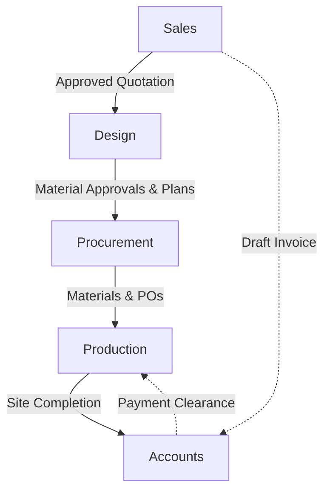

# 🏠 WoodAura — Interior Design Management Platform

**WoodAura** is an end-to-end, enterprise-grade interior design business management platform built to streamline every stage of the project lifecycle — from sales and quotations through design, procurement, production, and financial accounting.

Built on the **MERN stack** (MongoDB, Express.js, React, Node.js), it provides role-based dashboards and workflows for over **15 distinct user roles**, enabling teams across departments to collaborate in real time.

---

## 📋 Table of Contents

- [Overview](#overview)
- [Key Features](#key-features)
- [Tech Stack](#tech-stack)
- [Architecture](#architecture)
- [Project Structure](#project-structure)
- [User Roles & Access Control](#user-roles--access-control)
- [Module Breakdown](#module-breakdown)
- [API Endpoints](#api-endpoints)
- [Database Models](#database-models)
- [State Management](#state-management)
- [Environment Variables](#environment-variables)
- [Getting Started](#getting-started)
- [Deployment](#deployment)
- [Contributing](#contributing)
- [License](#license)

---

## Overview

WoodAura digitises the complete interior design business workflow:

1. **Sales** — Lead capture, client management, site visits, quotation creation with line-item images, and approval workflows.
2. **Design** — Project planning, task management with Kanban boards, checklists, material approvals, and progress tracking.
3. **Procurement** — Vendor management, purchase orders, inventory tracking, material requests, and vendor comparisons.
4. **Production** — Site project management, team assignment, task boards, site attendance, safety logs, progress reports, and project handoff.
5. **Accounts** — Payment tracking, expense management, and financial reporting.
6. **Administration** — User/staff management, settings, meetings, notifications, and AI-assisted tools.

### Project Lifecycle Flow



### Detailed Lifecycle Steps

#### 1. Sales & Quotation Phase
- **Quotation Creation:** Sales creates a `Quotation` with detailed line items and Cloudinary-hosted images.
- **Approval & Project Generation:** Once the Quotation is marked as `Approved` by Admin/Client, the system automatically:
  - Generates a Draft `Invoice`.
  - Creates a new `Project` record initialized in the **Design** stage.
  - Automatically assigns a Design Manager and sends them a notification.

#### 2. Design Phase
- **Task Management:** The Design team uses Kanban boards and Checklists to track drawing and planning progress.
- **Handoff:** Once the design is finalized, the Design Manager triggers the project handoff. 
- **Transition:** The project `stage` automatically advances to **Procurement**, and notifications are dispatched to the Procurement Manager.

#### 3. Procurement Phase
- **Material Sourcing:** Procurement Staff handle `Material Requests`, compare `Vendors`, and generate `Purchase Orders` (POs).
- **Inventory Updates:** Received materials update the `POInventory` and `Inventory` tracking systems.

#### 4. Production Phase
- **Production Project Creation:** An Admin formally creates a `ProductionProject` linked to the main `Project`.
- **Team Assignment & Handoff:** The Production Manager assigns Site Engineers/Supervisors and accepts the handoff, moving the project to an `Active` state.
- **Site Execution:** The team logs `SiteAttendance`, `SafetyLogs`, and `SiteProgressReports`.
- **Production Completion:** The Production Manager submits the project for completion.

#### 5. Handover & Accounts
- **Final Admin Approval:** The Admin reviews the production completion and marks the project as `Admin Approved` (locked).
- **Final Handover:** The main project `handoverComplete` flag is set to true.
- **Accounts:** Finance tracks incoming payments against the generated invoices and logs `Expenses` against the project.

---

## Key Features

### 🎨 Sales & Quotations
- Professional quotation builder with line-item images (Cloudinary upload)
- Auto-calculated totals with tax (GST), discounts, and offer pricing
- Dimension tracking (L × D × H) with SqFt auto-calculation
- Bill preview modal before final submission
- Quotation status workflow: Draft → Under Review → Approved → Rejected
- PDF-ready quotation view with project details
- Quick-add client during quotation creation
- Invoice generation from approved quotations

### 📐 Design Management
- Project lifecycle management with stage tracking
- Kanban task board with drag-and-drop
- Design checklists and approval workflows
- Material review hub for design managers
- Task assignment and progress monitoring

### 📦 Procurement
- Vendor database with comparison tools
- Purchase order creation and tracking
- Inventory management with stock levels
- PO-based inventory tracking
- Material request workflow

### 🏗️ Production Management
- Project handoff from procurement to production
- Multi-role task boards (Project Manager, Engineer, Supervisor)
- Site attendance and safety log tracking
- Supervisor daily reports
- Staff replacement requests
- Site visit management
- Project completion workflow with payment clearance validation

### 💰 Accounts & Finance
- Payment collection tracking
- Expense management
- Project financial overview
- Budget vs. actuals reporting

### ⚙️ Administration
- Role-based user management (15+ roles)
- Staff directory with salary configuration
- Meeting scheduler
- Leave request system
- Push notification support (Web Push API)
- AI-powered assistant (Google Gemini integration)
- Application settings management
- Audit logging

### 🔔 Cross-Cutting Features
- **Real-time notifications** with push support
- **Approval workflows** across departments
- **Cloudinary** image hosting for all uploads
- **Role-based access control (RBAC)** at route and API level
- **Paginated data tables** for large datasets
- **Responsive design** for desktop and mobile
- **Rate limiting** and **security headers** (Helmet)

---

## Tech Stack

### Frontend
| Technology | Purpose |
|---|---|
| **React 19** | UI framework |
| **Vite 7** | Build tool & dev server |
| **React Router v7** | Client-side routing |
| **Redux Toolkit (RTK)** | Global state management |
| **RTK Query** | API data fetching & caching |
| **Lucide React** | Icon library |
| **Recharts** | Dashboard charts & analytics |
| **Tailwind CSS 4** | Utility-first styling |
| **date-fns** | Date formatting & manipulation |
| **react-day-picker** | Calendar/date input components |
| **react-markdown** | Markdown rendering (AI chat) |
| **@hello-pangea/dnd** | Drag-and-drop (Kanban boards) |
| **Lenis** | Smooth scroll library |

### Backend
| Technology | Purpose |
|---|---|
| **Node.js** | Runtime environment |
| **Express.js 4** | Web framework |
| **MongoDB** | NoSQL database |
| **Mongoose 8** | ODM / data modeling |
| **JWT** | Authentication tokens |
| **bcryptjs** | Password hashing |
| **Cloudinary** | Cloud image storage |
| **Multer** | File upload middleware |
| **Helmet** | Security headers |
| **Morgan** | HTTP request logging |
| **express-rate-limit** | API rate limiting |
| **express-validator** | Input validation |
| **compression** | Response compression |
| **web-push** | Push notifications |
| **@google/generative-ai** | AI features (Gemini) |
| **Nodemon** | Development auto-restart |

---

## Architecture

```
┌─────────────────────────────────────────────────┐
│                   Frontend (Vite + React)        │
│                                                   │
│  ┌──────────┐  ┌──────────┐  ┌──────────────┐   │
│  │  Views    │  │  Store   │  │  Controllers │   │
│  │ (by role) │  │ (Redux)  │  │  (Routes)    │   │
│  └──────────┘  └──────────┘  └──────────────┘   │
│       │              │              │             │
│       └──────────────┼──────────────┘             │
│                      │                            │
│              RTK Query APIs                       │
│  ┌─────────────────────────────────────────────┐ │
│  │ adminApi │ salesApi │ designApi │ prodApi   │ │
│  │ procurementApi │ accountsApi │ sharedApi   │ │
│  └─────────────────────────────────────────────┘ │
└──────────────────────┬──────────────────────────┘
                       │ HTTP / REST
┌──────────────────────┴──────────────────────────┐
│              Backend (Express.js)                │
│                                                   │
│  ┌──────────┐  ┌────────────┐  ┌──────────────┐ │
│  │  Routes   │  │ Controllers│  │  Middleware   │ │
│  │ (by dept) │  │ (by dept)  │  │ (auth, RBAC) │ │
│  └──────────┘  └────────────┘  └──────────────┘ │
│                      │                            │
│  ┌──────────┐  ┌────────────┐  ┌──────────────┐ │
│  │  Models   │  │  Services  │  │   Utils      │ │
│  │ (Mongoose)│  │ (business) │  │ (helpers)    │ │
│  └──────────┘  └────────────┘  └──────────────┘ │
└──────────────────────┬──────────────────────────┘
                       │
          ┌────────────┼────────────┐
          │            │            │
     ┌────┴────┐  ┌────┴────┐  ┌───┴──────┐
     │ MongoDB │  │Cloudinary│  │ Gemini AI│
     └─────────┘  └─────────┘  └──────────┘
```

---

## Project Structure

```
Interior/
├── Backend/
│   ├── server.js                    # Express server entry point
│   ├── env.js                       # Environment configuration
│   ├── package.json
│   └── src/
│       ├── config/                  # Database & service configs
│       ├── controllers/             # Business logic (domain-based)
│       │   ├── accounts/
│       │   ├── admin/
│       │   ├── design/
│       │   ├── procurement/
│       │   ├── production/
│       │   ├── sales/
│       │   └── shared/
│       ├── middleware/
│       │   ├── auth.js              # JWT verification & protect middleware
│       │   ├── errorHandler.js      # Global error handler
│       │   └── productionAuth.js    # Production-specific RBAC
│       ├── models/                  # Mongoose schemas (domain-based)
│       │   ├── accounts/            # Payment, Expense
│       │   ├── admin/               # User, Staff, Team, Meeting, Settings
│       │   ├── design/              # Project, Task, Checklist, KanbanTask
│       │   ├── procurement/         # Inventory, PurchaseOrder, Vendor, etc.
│       │   ├── production/          # ProductionProject, ProductionTask, etc.
│       │   ├── sales/               # Client, Quotation, Invoice
│       │   └── shared/              # Notification, Approval, AuditLog
│       ├── routes/                  # Express route definitions
│       │   ├── accounts/
│       │   ├── admin/
│       │   ├── design/
│       │   ├── procurement/
│       │   ├── production/
│       │   ├── sales/
│       │   └── shared/
│       ├── services/                # Business logic services
│       ├── scripts/                 # One-off migration scripts
│       └── utils/                   # Helper functions
│
├── Frontend/
│   ├── index.html
│   ├── package.json
│   ├── vite.config.js
│   └── src/
│       ├── main.jsx                 # React entry point
│       ├── App.jsx                  # Root component (auth gate)
│       ├── index.css                # Global styles
│       ├── App.css
│       ├── assets/                  # Static assets (logos, images)
│       ├── components/              # Shared/reusable components
│       ├── config/                  # App constants (API base URL)
│       ├── controllers/
│       │   ├── hooks/               # Role-based dashboard hooks
│       │   ├── layouts/             # Layout controllers
│       │   └── routes/
│       │       └── AppRoutes.jsx    # Centralised route config
│       ├── hooks/                   # Global custom hooks
│       ├── models/
│       │   └── context/             # React contexts (Toast, etc.)
│       ├── store/
│       │   ├── index.js             # Redux store configuration
│       │   ├── hooks.js             # Typed Redux hooks
│       │   ├── api/                 # RTK Query API slices
│       │   │   ├── adminApi.js
│       │   │   ├── salesApi.js
│       │   │   ├── designApi.js
│       │   │   ├── productionApi.js
│       │   │   ├── procurementApi.js
│       │   │   ├── accountsApi.js
│       │   │   ├── meetingApi.js
│       │   │   ├── authApi.js
│       │   │   └── sharedApi.js
│       │   ├── slices/              # Redux state slices
│       │   └── selectors/           # Memoised selectors
│       ├── utils/                   # Utility functions
│       └── views/                   # Feature-based view modules
│           ├── auth/                # Login page
│           ├── admin/               # Admin dashboard & modules
│           │   ├── Dashboard.jsx
│           │   ├── Projects.jsx
│           │   ├── Quotations.jsx
│           │   ├── NewQuotation.jsx
│           │   ├── Inventory.jsx
│           │   ├── PurchaseOrders.jsx
│           │   ├── Clients.jsx
│           │   ├── Staff.jsx
│           │   ├── Tasks.jsx
│           │   ├── Invoice.jsx
│           │   ├── Meetings.jsx
│           │   ├── Settings.jsx
│           │   ├── Users.jsx
│           │   ├── Reports.jsx
│           │   ├── AIChat.jsx
│           │   └── ...components/
│           ├── sales/               # Sales staff dashboard
│           ├── design/              # Design department views
│           ├── procurement/         # Procurement views
│           ├── production/          # Production views
│           │   ├── project_manager/ # PM dashboard & tools
│           │   ├── project_engineer/# Engineer tasks & reports
│           │   ├── site_engineer/   # Site engineer portal
│           │   └── site_supervisor/ # Supervisor portal
│           ├── Accounts/            # Finance & accounting views
│           └── common/              # Shared views (meetings, etc.)
│
├── README.md                        # This file
├── package.json                     # Root package (deployment)
└── server.js                        # Root entry (production proxy)
```

---

## User Roles & Access Control

WoodAura implements granular RBAC with **15 user roles** organised across **6 departments**:

| Department | Manager Role | Staff Roles |
|---|---|---|
| **Admin** | Super Admin, Admin, Manager | Staff, User |
| **Sales** | — | Sales |
| **Design** | Design Manager | Design Staff |
| **Procurement** | Procurement Manager | Procurement Staff |
| **Production** | Project Manager | Project Engineer, Site Engineer, Site Supervisor |
| **Accounts** | Accounts Manager | Accounts Staff |

### Layout Routing

- **Admin Layout** — Super Admin, Admin, Manager, Design Manager, Project Manager, Project Engineer, Site Engineer, Site Supervisor
- **Sales Layout** — Sales, Design Staff, Accounts Manager, Accounts Staff
- **Procurement Layout** — Procurement Manager, Procurement Staff

Each role sees only the navigation items and pages relevant to their department. Route guards at both the frontend (React Router) and backend (middleware) enforce access.

---

## Module Breakdown

### 1. Authentication & Users
- JWT-based authentication with bcrypt password hashing
- Token stored in `localStorage`, sent via `Authorization` header
- User creation with automatic department assignment based on role
- Status management: Active / Inactive / Suspended
- Last login tracking

### 2. Projects
- Full lifecycle: Design → Procurement → Production → Completed
- Kanban board, table list, and timeline views
- Budget tracking and deadline management
- Progress percentage with visual indicators
- Filtering by stage, status, and grouping options
- Paginated project tables (10 items/page)

### 3. Quotations
- Rich quotation builder with:
  - Client selection (with quick-add)
  - Project details and contact info
  - Payment & cancellation policies
  - Warranty terms
  - Line items with name, description, section, finish, material, size
  - Dimensions (L × D × H) with SqFt calculation
  - Per-item image upload via Cloudinary
  - Unit selection (Sqft, Rft, Nos, Lumpsum, etc.)
  - Quantity, rate, and auto-calculated amounts
- Discount policy toggle with amount
- Tax configuration (GST rates)
- Offer price calculation
- Review draft / Review & Save workflow
- Bill preview modal
- Notes and Terms & Conditions

### 4. Invoices
- Generated from approved quotations
- Payment tracking and status
- Professional invoice view

### 5. Inventory & Procurement
- Item catalogue with sections, pricing, and stock levels
- Vendor database and comparison tools
- Purchase order creation and lifecycle
- PO-linked inventory tracking
- Material request workflows with approval

### 6. Production
- Project assignment and team management
- Task creation with priority, deadlines, and dependencies
- Site attendance logging
- Safety log tracking
- Progress reports (daily supervisor reports)
- Project completion workflow with advance payment clearance
- Staff replacement requests

### 7. Accounts
- Payment collection tracking per project
- Expense management and categorisation
- Financial KPIs and reporting

### 8. Meetings
- Meeting scheduler with attendees
- Agenda and notes
- Accessible across departments

### 9. Notifications & Approvals
- In-app notification system
- Web Push notifications (VAPID keys)
- Cross-department approval workflows
- Task deadline auto-checker (hourly)

### 10. AI Assistant
- Integrated Google Gemini AI
- Context-aware querying
- Auto-suggestions for fields

---

## API Endpoints

### Shared
| Method | Endpoint | Description |
|---|---|---|
| POST | `/api/auth/login` | User login |
| POST | `/api/auth/register` | User registration |
| GET | `/api/auth/me` | Get current user |
| POST | `/api/upload` | Upload image (Cloudinary) |
| GET/POST | `/api/notifications` | Notifications CRUD |
| GET/POST/PATCH/DELETE | `/api/approvals` | Approvals CRUD |
| POST | `/api/ai/query` | AI query |
| POST | `/api/ai/suggest` | AI suggestions |
| POST | `/api/push/subscribe` | Push notification subscribe |

### Admin
| Method | Endpoint | Description |
|---|---|---|
| GET/POST/PUT/DELETE | `/api/users` | User management |
| GET/POST/PUT/DELETE | `/api/staff` | Staff management |
| GET/POST/PUT/DELETE | `/api/teams` | Team management |
| GET/POST | `/api/team` | Team members |
| GET/POST/PUT/DELETE | `/api/meetings` | Meeting management |
| GET/POST/PUT | `/api/leaves` | Leave requests |
| GET/PUT | `/api/settings` | App settings |
| GET | `/api/reports` | Report generation |

### Sales
| Method | Endpoint | Description |
|---|---|---|
| GET/POST/PUT/DELETE | `/api/clients` | Client management |
| GET/POST/PUT/DELETE | `/api/quotations` | Quotation CRUD |
| GET/POST/PUT/DELETE | `/api/invoices` | Invoice CRUD |

### Design
| Method | Endpoint | Description |
|---|---|---|
| GET/POST | `/api/design` | Design workflows |
| GET/POST/PUT/DELETE | `/api/projects` | Project management |
| GET/POST/PUT/DELETE | `/api/tasks` | Task management |
| GET/POST/PUT/DELETE | `/api/kanban-tasks` | Kanban tasks |
| GET/POST/PUT/DELETE | `/api/checklists` | Design checklists |

### Procurement
| Method | Endpoint | Description |
|---|---|---|
| GET/POST/PUT/DELETE | `/api/procurement` | Procurement workflows |
| GET/POST/PUT/DELETE | `/api/vendors` | Vendor management |
| GET/POST/PUT/DELETE | `/api/purchase-orders` | Purchase orders |
| GET/POST/PUT/DELETE | `/api/inventory` | Inventory management |
| GET/POST/PUT/DELETE | `/api/po-inventory` | PO inventory tracking |

### Production
| Method | Endpoint | Description |
|---|---|---|
| GET/POST/PUT/DELETE | `/api/production` | Production data |
| GET/POST/PUT/DELETE | `/api/production-management` | Production management |
| GET/POST | `/api/site-visits` | Site visit logging |

### Accounts
| Method | Endpoint | Description |
|---|---|---|
| GET/POST/PUT/DELETE | `/api/accounts` | Payments & expenses |

---

## Database Models

### Admin Domain
- **User** — Authentication, roles, departments, status
- **Staff** — Employee records, salary, attendance
- **Team** — Team definitions
- **TeamMember** — Team membership
- **Meeting** — Meeting scheduler
- **LeaveRequest** — Leave management
- **Settings** — Application configuration

### Sales Domain
- **Client** — Customer records
- **Quotation** — Line items, pricing, terms, images, dimensions
- **Invoice** — Billing and payment

### Design Domain
- **Project** — Full project lifecycle tracking
- **Task** — Assignments with attachments and progress
- **Checklist** — Design review checklists
- **KanbanTask** — Drag-and-drop board items

### Procurement Domain
- **Inventory** — Stock items and levels
- **PurchaseOrder** — PO lifecycle
- **POInventory** — PO-linked stock
- **Vendor** — Supplier records
- **VendorComparison** — Price comparisons
- **VendorPurchase** — Purchase records
- **MaterialRequest** — Internal material requests

### Production Domain
- **ProductionProject** — On-site project tracking
- **ProductionTask** — Site tasks with progress
- **SiteAttendance** — Daily attendance
- **SafetyLog** — Safety compliance
- **SiteProgressReport** — Progress updates
- **SiteVisit** — Visit records
- **SupervisorDailyReport** — Supervisor logs
- **StaffReplacementRequest** — Replacement workflows
- **ProductionActivityLog** — Activity auditing

### Accounts Domain
- **Payment** — Payment collections
- **Expense** — Expense records

### Shared Domain
- **Notification** — In-app notifications
- **Approval** — Cross-department approvals
- **AuditLog** — System audit trail
- **PushSubscription** — Web push subscriptions

---

## State Management

The frontend uses **Redux Toolkit** with **RTK Query** for a clean separation:

| Layer | Purpose |
|---|---|
| `store/slices/authSlice` | Authentication state (user, token) |
| `store/api/adminApi` | Admin endpoints (projects, staff, users, etc.) |
| `store/api/salesApi` | Sales endpoints (quotations, clients) |
| `store/api/designApi` | Design endpoints (tasks, kanban) |
| `store/api/productionApi` | Production endpoints |
| `store/api/procurementApi` | Procurement endpoints |
| `store/api/accountsApi` | Accounts endpoints |
| `store/api/meetingApi` | Meeting endpoints |
| `store/api/sharedApi` | Shared endpoints (upload, AI, notifications) |
| `store/api/authApi` | Auth endpoints |

RTK Query provides automatic caching, invalidation, and refetching with tag-based cache management.

---

## Environment Variables

### Backend (`Backend/.env`)

```env
# Server
NODE_ENV=development
PORT=5000

# Database
MONGODB_URI=mongodb+srv://<user>:<pass>@cluster.mongodb.net/<dbname>

# Authentication
JWT_SECRET=your_jwt_secret_key
JWT_EXPIRE=30d

# Cloudinary (Image Uploads)
CLOUDINARY_CLOUD_NAME=your_cloud_name
CLOUDINARY_API_KEY=your_api_key
CLOUDINARY_API_SECRET=your_api_secret

# Google Gemini AI
GEMINI_API_KEY=your_gemini_api_key

# Web Push Notifications (VAPID)
VAPID_PUBLIC_KEY=your_vapid_public_key
VAPID_PRIVATE_KEY=your_vapid_private_key
VAPID_MAILTO=mailto:your@email.com
```

### Frontend (`Frontend/.env`)

```env
VITE_API_URL=http://localhost:5000/api
VITE_VAPID_PUBLIC_KEY=your_vapid_public_key
```

---

## Getting Started

### Prerequisites

- **Node.js** v18+ 
- **MongoDB** (Atlas or local)
- **Cloudinary** account (for image uploads)
- **Git**

### Installation

```bash
# Clone the repository
git clone https://github.com/ryphiraofficial/inter-des.git
cd inter-des

# Install backend dependencies
cd Backend
npm install

# Install frontend dependencies
cd ../Frontend
npm install
```

### Development

```bash
# Terminal 1 — Start the backend
cd Backend
npm run dev
# → Server runs on http://localhost:5000

# Terminal 2 — Start the frontend
cd Frontend
npm run dev
# → App runs on http://localhost:5173
```

### Production Build

```bash
# Build the frontend
cd Frontend
npm run build

# Start the production server
cd ../Backend
npm start
# → Serves both API and static frontend from port 5000
```

---

## Deployment

The project is configured for **Hostinger** deployment with the root `server.js` and `package.json` acting as the entry point:

```
Root server.js → imports Backend/server.js
Root package.json → "start": "node server.js"
```

The backend serves the built frontend from `Frontend/dist/` in production mode, providing a single-server deployment.

### Deployment Steps

1. Push code to the repository
2. Set all environment variables on the hosting platform
3. Run `npm install` in both `Backend/` and `Frontend/`
4. Run `npm run build` in `Frontend/`
5. Start with `npm start` from the root directory

---

## Contributing

1. Create a feature branch from `main`
2. Follow the existing module/domain-based file organisation
3. Use the established patterns (hooks, RTK Query, controller/route/model separation)
4. Test your changes locally before pushing
5. Push and create a pull request

---

## License

ISC License

---

**Built with ❤️ by the WoodAura Team**
